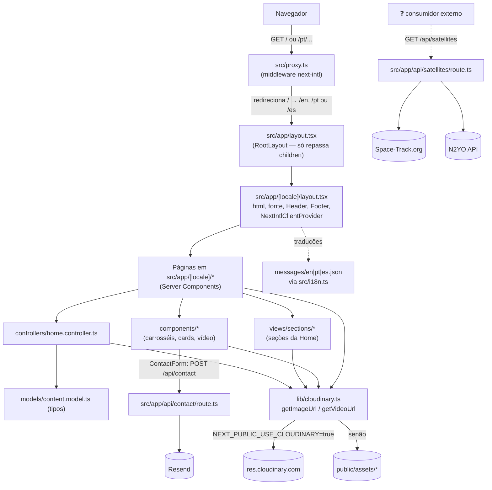

# Auditoria Inicial do Projeto

> **Repositório:** `ZarbL/IdeiaSpacewebsite` · **Commit analisado:** `a71fa4c` (branch `documentacao`, igual a `main` no momento da análise) · **Data:** 29/09/2026
>
> Este documento é um **material de estudo**. Ele descreve o estado **real** do código no commit acima, não o estado desejado. Não é a documentação oficial do projeto.

### Como ler este documento

Ao longo do texto uso três marcadores para separar fato de hipótese:

| Marcador | Significado |
|---|---|
| ✅ | **Verificado** diretamente no código/configuração do repositório. |
| ⚠️ | **Divergência ou ponto de atenção** — algo que não bate entre código, configuração e documentação, ou que pode ser um problema. |
| ❓ | **Incerto / hipótese** — não é possível confirmar só com o repositório (depende de painel da Vercel, Cloudinary, contas externas etc.). |

Referências a código seguem o formato `arquivo:linha`.

---

## 1. Objetivo do projeto

✅ É o **site institucional da IdeiaSpace** (razão social no rodapé: *Ideia Space Educacao Espacial LTDA*, `src/components/Footer.tsx:20-24`), uma empresa de **educação espacial**. O conteúdo (textos em `messages/*.json`) apresenta:

- o **Desafio Espacial** — programa em que estudantes concebem, projetam, constroem e "lançam" missões espaciais (satélites do tipo **PocketQube**);
- as **missões** já realizadas por alunos (ex.: **UAI-SAT**, **SARI-1**, **ANISC**);
- **recursos educacionais** e tecnologias (kits, FlatSat, ferramenta de programação de missões);
- a **equipe/liderança**, parceiros, depoimentos e um **formulário de contato**.

✅ O site é **multilíngue** (inglês, português e espanhol).

✅ Além das páginas, o projeto expõe **duas rotas de API** (funções server-side do Next.js): envio do formulário de contato por e-mail e um **proxy de dados orbitais (TLE) de satélites**.

❓ A rota de satélites **não é consumida por nenhuma página deste repositório** (ver §7 e §13). O menu aponta "Nossos Satélites" para um site externo (`https://tleideiaspaceview.vercel.app`). É *plausível* que esse site externo consuma `/api/satellites`, mas isso **não pode ser confirmado** a partir deste repositório.

---

## 2. Visão geral da arquitetura

### 2.1 Em uma frase

É **uma única aplicação Next.js 16 (App Router)**, sem banco de dados e sem backend separado: páginas React renderizadas no servidor + alguns componentes interativos no cliente + duas rotas de API que conversam com serviços externos (Resend, Space-Track, N2YO). Mídia pesada pode vir do **Cloudinary** ou da pasta `public/`.

### 2.2 Diagrama de blocos



### 2.3 Camadas e responsabilidades

| Camada | Onde | Papel real no código |
|---|---|---|
| Roteamento/i18n | `src/proxy.ts`, `src/routing.ts`, `src/i18n.ts` | Detecta idioma, prefixa URLs com `/en`, `/pt`, `/es` e carrega o JSON de traduções certo. |
| Layouts | `src/app/layout.tsx`, `src/app/[locale]/layout.tsx` | O root layout só devolve `children`; o layout de locale monta `<html>`, fonte, `Header`, `<main>` e `ConditionalFooter`. |
| Páginas | `src/app/[locale]/**/page.tsx` | Server Components assíncronos que buscam traduções e montam a página com componentes. |
| "MVC" | `controllers/`, `models/`, `views/sections/` | Padrão usado **apenas na Home**: o controller monta um objeto `PageContent` a partir das traduções; as seções o recebem por props. As demais páginas não usam esse padrão. |
| Componentes | `src/components/` | UI: carrosséis, cards, vídeo com lazy-load, formulário, cabeçalho/rodapé. |
| Utilitários | `src/lib/` | `cloudinary.ts` (central — resolve URLs de mídia), `assets.ts` e `wordpress.ts` (não usados). |
| API | `src/app/api/*/route.ts` | Funções server-side (Route Handlers). |
| Conteúdo | `messages/*.json` | **Todo o texto** do site — funciona como um "CMS em arquivo". |

⚠️ O README descreve o projeto como "MVC Pattern". Na prática o padrão só existe na Home; é mais correto dizer que o projeto é **baseado em componentes** com um controller isolado.

---

## 3. Tecnologias

Versões "declaradas" vêm do `package.json`; versões "resolvidas" vêm do `package-lock.json` (o que o `npm ci` instala). `node_modules` **não está instalado** nesta máquina, então nada foi executado.

| Tecnologia | Declarada | Resolvida (lock) | Função no projeto | Uso real |
|---|---|---|---|---|
| Node.js | `.nvmrc`: `20` | — (Next exige `>=20.9.0`) | Runtime | ✅ |
| Next.js | `^16.0.8` | 16.0.8 | Framework (App Router, SSR/SSG, Route Handlers, `next/image`, `next/font`) | ✅ |
| React / React DOM | `^19.0.0` | 19.2.0 | UI | ✅ |
| TypeScript | `^5` | 5.9.3 | Tipagem (`strict: true`) | ✅ |
| babel-plugin-react-compiler | `1.0.0` | 1.0.0 | React Compiler (`reactCompiler: true` em `next.config.ts`) | ✅ |
| next-intl | `^4.5.5` | 4.5.5 | Internacionalização (middleware, `getTranslations`, `useTranslations`) | ✅ |
| Tailwind CSS (+ `@tailwindcss/postcss`) | `^4` | 4.1.17 | Estilo utilitário (via `@import "tailwindcss"` em `globals.css`) | ✅ |
| CSS puro / CSS Modules | — | — | Estilos de componentes (`*.css`, `*.module.css`) | ✅ |
| Resend | `^6.5.2` | 6.5.2 | Envio do e-mail do formulário de contato | ✅ (`api/contact`) |
| cloudinary (SDK Node) | `^2.8.0` | 2.8.0 | Upload de mídia pelo script `scripts/upload-to-cloudinary.js` | ✅ só no script |
| next-cloudinary | `^6.17.5` | 6.17.5 | Componentes Next para Cloudinary | ⚠️ **não importado em nenhum arquivo** |
| three | `^0.182.0` | 0.182.0 | 3D | ⚠️ **não importado** |
| react-globe.gl | `^2.37.0` | 2.37.0 | Globo 3D | ⚠️ **não importado** |
| satellite.js | `^6.0.2` | 6.0.2 | Propagação orbital de TLE | ⚠️ **não importado** |
| Vitest (+ `@vitest/coverage-v8`) | `^2.1.9` | 2.1.9 | Testes e cobertura | ✅ |
| Testing Library (react, jest-dom, user-event) | vários | 16.3.3 (react) | Utilitários de teste | ✅ configurado; ❓ sem testes de componente ainda |
| jsdom | `^25.0.1` | 25.0.1 | Ambiente DOM dos testes | ✅ |
| fast-check | `^3.23.2` | 3.23.2 | Testes de propriedade / fuzzing | ✅ |
| ESLint + eslint-config-next | `^9` / `16.0.3` | 9.39.1 | Lint | ✅ |
| dotenv | `^17.2.3` | 17.2.3 | Lê `.env.local` no script de upload | ✅ só no script |
| sharp | não declarado | 0.34.5 (opcional, transitivo do Next) | Usado por `scripts/generate-favicon.js` | ⚠️ ver §13 |
| FFmpeg | externo | — | Compressão de vídeo (`scripts/compress-videos.js`) | ✅ só no script |
| Vercel | `vercel.json` | — | Hospedagem/deploy (região `gru1` — São Paulo) | ✅ configurado |
| Git LFS | `.gitattributes` | — | Armazena os `.mp4` | ✅ |
| GitHub Actions | `.github/workflows/` | — | CI, fuzz, CodeQL, segurança, deploy | ✅ |

---

## 4. Estrutura do repositório

```
IdeiaSpacewebsite/
├── .github/
│   ├── workflows/            # ci, codeql, deploy, fuzz, security (§9)
│   ├── ISSUE_TEMPLATE/       # bug_report, feature_request
│   ├── pull_request_template.md
│   └── CODEOWNERS            # "* @ZarbL"
├── docs/
│   ├── BACKLOG.md            # aponta para as issues #3–#8
│   └── CI-CD.md              # guia dos workflows
├── messages/                 # en.json, pt.json, es.json — TODO o texto do site (204 chaves cada)
├── public/
│   ├── assets/               # imagens (png/jpg/jpeg)
│   │   └── compressed/       # 13 vídeos .mp4 (Git LFS)
│   └── *.svg                 # ícones padrão do create-next-app (não usados)
├── scripts/                  # compress-videos, upload-to-cloudinary, generate-favicon (Node CJS)
├── src/
│   ├── app/
│   │   ├── layout.tsx        # RootLayout: só retorna children
│   │   ├── globals.css       # Tailwind + tokens + animações globais
│   │   ├── favicon.ico, icon.png
│   │   ├── [locale]/         # todas as páginas, prefixadas por idioma
│   │   │   ├── layout.tsx    # html/body, fonte, Header, Footer, provider i18n, metadata
│   │   │   ├── page.tsx      # Home
│   │   │   ├── about/  missions/  services/  technologies/  teacher-resources/
│   │   └── api/
│   │       ├── contact/route.ts
│   │       ├── satellites/route.ts
│   │       └── __tests__/
│   ├── components/           # 33 componentes .tsx + CSS (12 não usados — §6.5)
│   ├── views/sections/       # 6 seções da Home (1 não usada)
│   ├── controllers/          # home.controller.ts (+ teste)
│   ├── models/               # content.model.ts (interfaces)
│   ├── lib/                  # cloudinary.ts (+ testes), assets.ts, wordpress.ts
│   ├── __tests__/            # messages-parity.test.ts
│   ├── i18n.ts               # config de requisição do next-intl
│   ├── routing.ts            # locales e defaultLocale
│   └── proxy.ts              # middleware (Next 16 renomeou middleware → proxy)
├── next.config.ts            # React Compiler, imagens, headers de segurança/cache, plugin next-intl
├── vercel.json               # build/dev/install, região gru1, deploy em main, LFS
├── vitest.config.ts / vitest.setup.ts
├── eslint.config.mjs / postcss.config.mjs / tsconfig.json
├── .nvmrc (20) / .editorconfig / .gitattributes (mp4→LFS) / .gitleaks.toml
├── README.md / API_DOCUMENTATION.md / CONTRIBUTING.md / SECURITY.md / CHANGELOG.md
└── graphify-out/             # saída do Graphify (NÃO versionada — aparece como untracked)
```

Números: **183 arquivos versionados**; ~7.000 linhas entre `.tsx`, `.css`, `.json` de mensagens e scripts. O maior arquivo de código é `src/app/globals.css` (491 linhas); o maior componente é `Header.tsx` (250 linhas).

Alias de import: `@/*` → `src/*` (`tsconfig.json` e `vitest.config.ts`).

---

## 5. Fluxo da aplicação

### 5.1 Do request à página renderizada

1. **Requisição chega** (ex.: `GET /`).
2. **`src/proxy.ts`** (middleware do next-intl) roda para os caminhos do `matcher` `['/', '/(pt|en|es)/:path*']` (`src/proxy.ts:8`). Rotas `/api/*` **não** passam por ele.
   - Em `/`, o next-intl decide o idioma e **redireciona** para `/en`, `/pt` ou `/es`. O `defaultLocale` é **`en`** (`src/routing.ts:9`).
   - ❓ A detecção automática por cabeçalho `Accept-Language`/cookie é o comportamento **padrão** do next-intl quando não configurado — não há configuração explícita no código, então o comportamento exato não foi testado aqui.
3. **`src/app/layout.tsx`** apenas repassa `children` (o `<html>` fica no layout de locale — padrão do next-intl).
4. **`src/app/[locale]/layout.tsx`**:
   - `generateStaticParams()` gera `en`, `pt`, `es` → as páginas podem ser **pré-renderizadas estaticamente**;
   - `setRequestLocale(locale)` habilita renderização estática com next-intl;
   - `getMessages()` carrega o JSON de traduções (resolvido por `src/i18n.ts`, que faz `import(\`../messages/${locale}.json\`)` e cai para `en` se o locale for inválido);
   - renderiza `<html lang>`, fonte **Roboto Condensed** (`next/font/google`), `NextIntlClientProvider`, `Header`, `<main>{children}</main>` e `ConditionalFooter`;
   - exporta `metadata` (título, descrição, ícones, OpenGraph) — ⚠️ **fixo em inglês** para todos os idiomas.
5. **A página** (Server Component) chama `getTranslations(...)`, resolve URLs de mídia com `getImageUrl`/`getVideoUrl` e monta os componentes.
6. **No navegador**, os componentes marcados com `'use client'` (32 arquivos) são hidratados: carrosséis começam a girar, vídeos entram em lazy-load via `IntersectionObserver`, contadores animam etc.

### 5.2 Resolução de mídia (fluxo crítico)

Toda imagem/vídeo passa por `src/lib/cloudinary.ts`:

```
getVideoUrl('space.mp4')
  ├─ se NEXT_PUBLIC_USE_CLOUDINARY === 'true' E 'space.mp4' está no videoMap
  │     → https://res.cloudinary.com/<cloud>/video/upload/q_auto:eco,f_auto/ideiaspace/space
  └─ senão → '/assets/space.mp4'
```

- `<cloud>` = `NEXT_PUBLIC_CLOUDINARY_CLOUD_NAME` ou, se ausente, o valor fixo **`dgyueliom`** (`src/lib/cloudinary.ts:4`).
- `getImageUrl` funciona igual, com `imageMap`; `vetorizada.png` (logo) **sempre** vem do local.
- ⚠️ **Os vídeos locais não existem no caminho gerado.** O fallback local gera `/assets/<nome>.mp4`, mas os vídeos estão em `public/assets/compressed/<nome>.mp4`. Resultado: **sem `NEXT_PUBLIC_USE_CLOUDINARY=true`, nenhum vídeo do site carrega** (404). Isso afeta o desenvolvimento local e o CI. Ver §13.

### 5.3 Fluxo do formulário de contato

1. Usuário preenche `ContactForm` (Home, seção `#contact`) — estado local com `useState`.
2. `fetch('/api/contact', { method: 'POST', body: JSON })` (`src/components/ContactForm.tsx:36`).
3. `src/app/api/contact/route.ts`:
   - JSON inválido → trata como corpo vazio;
   - faltando campo → **400** `"Todos os campos são obrigatórios"`;
   - campo não-string ou longo demais (name 200, email 320, subject 200, message 5000) → **400**;
   - e-mail fora do regex `^[^\s@]+@[^\s@]+\.[^\s@]+$` → **400**;
   - **sem `RESEND_API_KEY`** → **200** com `useMailto: true` e um `mailto:admin@ideiaspace.com?...` preenchido;
   - **com a chave** → envia via Resend (`from: onboarding@resend.dev`, `to: admin@ideiaspace.com`, `replyTo`: e-mail do usuário), com os campos **escapados** no HTML → **200** com `emailId`;
   - erro no envio → **500** com `mailto:` simples.
4. O componente mostra a mensagem retornada; se vier `useMailto`, faz `window.location.href = mailtoLink` (abre o cliente de e-mail). O formulário é limpo após 3 s.

⚠️ As mensagens de status vêm **da API, em português, fixas** — não passam pelo i18n. Um visitante em inglês vê "Mensagem enviada com sucesso!".

### 5.4 Fluxo da API de satélites

`GET /api/satellites?groups=<ideiaspace|stations|starlink|weather>` (padrão `stations`):

1. `ideiaspace` → fonte **Space-Track.org** (login por POST + consulta com o cookie); demais grupos → **N2YO**, um request por satélite, com 100 ms de intervalo e timeout global de 20 s.
2. Sem credenciais → devolve **TLE estático de fallback** (`X-Cache-Status: FALLBACK`).
3. Com credenciais → consulta **cache em memória** (8 h). Se válido → `HIT`.
4. Busca na fonte, **valida** o TLE (múltiplo de 3 linhas, linhas começando com `1 ` e `2 `, sem HTML), grava no cache → `MISS`.
5. Erro ou TLE inválido → cache expirado (`STALE`) se existir, senão fallback estático.

Resposta sempre `text/plain` com cabeçalhos `X-Cache-Status` e `X-Data-Source`.

### 5.5 Navegação do usuário

**Menu (`src/components/Header.tsx`)** — desktop e mobile têm os mesmos itens:

| Rótulo (chave → texto en / pt) | Destino |
|---|---|
| `nav.home` → Home / Início | `/{locale}` |
| `nav.about` → About Us / Sobre Nós | `/{locale}/about` |
| `nav.missions` → Missions / Missões | `/{locale}/missions` |
| `nav.spaceChallenge` → Challenge / Desafio | `/{locale}/services` |
| `nav.teacherResources` → Resources / Recursos | `/{locale}/technologies` ⚠️ |
| `nav.programmingTool` → Programming / Programação | **externo** `https://ideia-spacetoweb.vercel.app/` |
| `nav.satellites` → Our Satellites / Nossos Satélites | **externo** `https://tleideiaspaceview.vercel.app` |
| seletor de idioma (🇺🇸 🇧🇷 🇪🇸) | troca o prefixo da URL atual |
| `nav.contact` → Contact / Contato | `/{locale}#contact` |

Observe o **descasamento de nomes**: a rota `/services` é o "Desafio"; a rota `/technologies` é "Recursos"; e a rota `/teacher-resources` **não é linkada em lugar nenhum** (página órfã, acessível só digitando a URL).

**Caminhos principais a partir da Home:** Hero → Estatísticas → "Ideia to Space" (botão → `/about`) → Desafio (botão → `/services`) → Missões (botão → `/missions`) → Tecnologias (botão → `/technologies`) → Contato (redes sociais + formulário).

**Rodapé (`Footer.tsx`)**: links para About, Services, Technologies, Contact, **Terms** (`/{locale}/terms`) e **Privacy** (`/{locale}/privacy`) — ⚠️ essas duas páginas **não existem**. Não aparece na rota `/missions` (`ConditionalFooter.tsx:10`).

---

## 6. Principais componentes

### 6.1 Páginas (`src/app/[locale]/`)

| Rota | Arquivo | O que renderiza |
|---|---|---|
| `/{locale}` | `page.tsx` | Container `h-screen` com *scroll-snap*: `HeroSection` (vídeo `ideiaforword`), `StatsCounter` (3 números animados), `IdeiaToSpaceSection`, `ChallengeSection` (vídeo `desafioespacial`), `MissionsSection` (vídeo `emblema`), `TechnologiesSection`, seção `#contact` com `SocialMediaCard` + `ContactForm`. Usa `HomeController`. |
| `/{locale}/about` | `about/page.tsx` | Vídeo de fundo `space.mp4` e 5 seções com *snap*: proposta de valor + `BenefitsCarousel`; história + `HistoryCarousel`; missão/visão/valores + `MVVCarousel`; `PartnersCarousel`; liderança (4 `LeadershipCard` com nomes/Instagram **fixos no código**, duplicados para mobile e desktop) + `SocialMediaCard`. |
| `/{locale}/missions` | `missions/page.tsx` (+ `layout.tsx` que só repassa) | Hero com vídeo `emblema` + `ScrollIndicator`; explicação com vídeo `space`; `MissionBadges` com 5 missões (imagens `missionbagde1..5.png`, textos de `missions.badges.*`). Sem rodapé. |
| `/{locale}/services` | `services/page.tsx` | "Desafio Espacial": hero com `transporter15.png`; texto + `StatsCarousel`; "Como funciona" + `PhasesCarousel` (3 fases); `#methodology` + `MethodologyCarousel` (5 etapas); depoimentos com vídeo `terranoite` + `TestimonialsCarousel` (4 depoimentos). |
| `/{locale}/technologies` | `technologies/page.tsx` | "Recursos": capa com `falcon9.jpg`; grade de 9 `ResourceCard`, **todos** com `isWorkInProgress={true}`. |
| `/{locale}/teacher-resources` | `teacher-resources/page.tsx` | Placeholder com vídeo e texto **fixo em português** ("Em breve..."). Chama `getTranslations('teacherResources')`, namespace que **não existe** nos JSON e cujo `t` não é usado. |

### 6.2 Seções da Home (`src/views/sections/`)

| Seção | Tipo | Observação |
|---|---|---|
| `HeroSection` | Server | Recebe `HeroContent`, mas **só usa `title` e `videoSrc`** — `subtitle`, `buttonText`, `buttonLink`, `aboutButton` são montados pelo controller e ignorados. |
| `IdeiaToSpaceSection` | Client | Mede a largura do título para limitar a largura do parágrafo (listener de `resize`). Descrição via `dangerouslySetInnerHTML`. |
| `ChallengeSection` | Server | Vídeo + texto (HTML das traduções) + link. |
| `MissionsSection` | Server | Vídeo `emblema` + link para `/missions`. |
| `TechnologiesSection` | Client | Recebe `content: any`; usa `useParams()` para o locale (as outras seções usam `useLocale()`). |
| `CTASection` | Server | ⚠️ **Não é usada.** O controller ainda monta `cta`. |

### 6.3 Componentes de estrutura e comportamento

| Componente | Papel |
|---|---|
| `Header` (client) | Logo, menu desktop/mobile, dropdown de idiomas. Troca de idioma: `pathname.replace('/'+locale, '/'+novo)` + `router.push`. Usa `next/link` e `next/navigation` diretamente (não os wrappers de `src/routing.ts`). |
| `ConditionalFooter` (client) → `Footer` | Esconde o rodapé em `/missions`. `Footer` não tem `'use client'`, mas vira client por ser importado de um client component. |
| `OptimizedVideo` (client) | `<video>` com lazy-load: só injeta o `<source>` quando entra na viewport (`rootMargin: 100px`), exceto se `priority`. É o componente de vídeo mais reutilizado (7 importadores). |
| `ContactForm` (client) | Formulário controlado; ver §5.3. |
| `StatsCounter` (client) | Anima números de 0 até o valor (2 s, 60 passos) ao ficar 30% visível. Extrai dígitos da string (`"1500+"` → 1500 + sufixo `+`). |
| `ScrollIndicator` (client) | "Role para mais" + animação de mouse (texto de `common.scrollForMore`). |
| `ResourceCard` (client) | Se `link` e **não** WIP → `<a target=_blank>`; senão, clique leva para `/{locale}#contact`. Textos "Work in Progress" e "Saiba Mais" **fixos**. |
| `MissionBadges` (client) | Grade de emblemas; ao clicar, mostra detalhes. Converte `**negrito**` e `\n\n` em HTML e usa `dangerouslySetInnerHTML`. |

### 6.4 Carrosséis e cards

| Componente | Dados | Observação |
|---|---|---|
| `BenefitsCarousel`, `HistoryCarousel`, `MVVCarousel` | 2 imagens + 1 vídeo cada, fixos | Visíveis só em telas `lg`. Animação por CSS. `alt` fixos em PT. |
| `PartnersCarousel` | 9 logos, fixos | Nomes de 4 a 9 são genéricos ("Partner 4"...). `partner9` usa caminho local direto. |
| `StatsCarousel` | 3 slides | Números `500` e `30` **fixos no código**; auto-avança a cada 4 s. A prop `locale` não é usada. |
| `PhasesCarousel` | via props | Carrossel manual (setas/pontos). |
| `MethodologyCarousel` | 5 etapas, imagens locais | Descrição aparece no hover (via `data-description` + CSS em `globals.css`). Animação de planetas no card 5. |
| `TestimonialsCarousel` → `TestimonialCard` | via props | Auto-avança a cada 5 s, pausa no hover/touch. |
| `LeadershipCard` | via props | Foto com `next/image`; links sociais (LinkedIn todos `"#"`). |
| `SocialMediaCard` | fixo | Instagram, TikTok, Facebook, WhatsApp (`wa.me/5561991983152`). |

### 6.5 Código presente mas **não utilizado** (confirmado por busca de imports e pelo Graphify)

- **Componentes:** `AnimatedPattern`, `CloudinaryVideo`, `EcosystemCard`, `ImpactCards`, `ImpactCarousel`, `InfoCard`, `JourneyCard`, `SlowVideo`, `TechnologyCard`, `WhatsAppButton`.
- **Importado mas não renderizado:** `AboutCarousel` (importado em `about/page.tsx:5`), `LeadershipCard` e `getVideoUrl` em `[locale]/page.tsx:8,13`.
- **Seção:** `CTASection`.
- **Libs:** `src/lib/assets.ts` (usa outro esquema de IDs do Cloudinary: `ideiaspace/videos/...`), `src/lib/wordpress.ts` (cliente de API REST do WordPress, `WORDPRESS_API_URL`).
- **Exports:** `Link`, `redirect`, `usePathname`, `useRouter` de `src/routing.ts`.

Isso é relevante para a documentação: o README descreve vários desses como partes ativas do site (ex.: "WhatsAppButton — botão flutuante").

---

## 7. Dependências e integrações

### 7.1 Serviços externos

| Serviço | Onde | Como | Sem configuração |
|---|---|---|---|
| **Resend** (e-mail) | `api/contact/route.ts` | SDK `resend`, instanciado sob demanda | Fallback `mailto:` |
| **Space-Track.org** (TLE) | `api/satellites/route.ts` | `fetch` com login por cookie, a cada busca não-cacheada | TLE estático |
| **N2YO** (TLE) | `api/satellites/route.ts` | `fetch` por satélite, API key na URL | TLE estático |
| **Cloudinary** (CDN de mídia) | `lib/cloudinary.ts` (URLs), `scripts/upload-to-cloudinary.js` (upload) | URLs montadas "à mão" (sem SDK no runtime) | Caminhos locais (quebrados para vídeo — §5.2) |
| **Google Fonts** | `[locale]/layout.tsx` | `next/font/google` (baixado no build) | — |
| **WordPress REST** | `lib/wordpress.ts` | `fetch` com revalidação | Código não usado |
| Sites externos IdeiaSpace | `Header.tsx`, `technologies/page.tsx` | Links `<a target=_blank>` | — |
| Redes sociais | `Footer`, `SocialMediaCard`, `about/page.tsx` | Links | — |

### 7.2 Variáveis de ambiente (lidas de fato pelo código)

| Variável | Lida em | Escopo |
|---|---|---|
| `NEXT_PUBLIC_USE_CLOUDINARY` | `lib/cloudinary.ts`, `lib/assets.ts` | **Pública** (vai para o bundle; avaliada no build) |
| `NEXT_PUBLIC_CLOUDINARY_CLOUD_NAME` | `lib/cloudinary.ts`, script de upload | Pública (default `dgyueliom`) |
| `RESEND_API_KEY` | `api/contact` | Servidor |
| `N2YO_API_KEY` | `api/satellites` | Servidor |
| `SPACETRACK_USERNAME`, `SPACETRACK_PASSWORD` | `api/satellites` | Servidor |
| `CLOUDINARY_API_KEY`, `CLOUDINARY_API_SECRET` | `scripts/upload-to-cloudinary.js` | Só local (script) |
| `WORDPRESS_API_URL` | `lib/wordpress.ts` | Não usado |
| `FUZZ_RUNS` | testes de fuzz | CI |

✅ Não há `.env.example` no repositório (o `.gitignore` ignora `.env*`). ❓ Os valores de produção estão (presumivelmente) no painel da Vercel — não verificáveis aqui.

### 7.3 Acoplamentos importantes

1. **`lib/cloudinary.ts` é o ponto mais acoplado do sistema** (19 importadores; `getImageUrl` e `getVideoUrl` são os "god nodes" do Graphify com 27 e 25 conexões). Os mapas `videoMap`/`imageMap` precisam casar **exatamente** com:
   - os nomes de arquivo usados nas páginas (sensível a maiúsculas: `Terraespaco.mp4` vs `terraespaco.mp4`, `impactocard2.MP4`);
   - os `public_id` criados pelo script de upload (`folder: 'ideiaspace'` + nome sem extensão);
   - os arquivos em `public/assets/`.
2. **Chaves de tradução** são strings soltas no código (`t('services.ecosystem.testimonials.roseno.name')`). Renomear uma chave no JSON quebra a página sem erro de compilação. O teste de paridade só garante que os 3 idiomas têm as mesmas chaves — não que o código usa chaves existentes.
3. **HTML dentro das traduções**: `about.historyDescription`, `about.mvvContent`, `challenge.description`, `ideiaToSpace.description`, `technologies.description` contêm `<br/>` etc. e são renderizados com `dangerouslySetInnerHTML`. Quem edita o JSON está, na prática, editando HTML.
4. **Contrato `/api/contact` ↔ `ContactForm`**: o componente depende dos campos `message`, `error`, `useMailto`, `mailtoLink` da resposta.
5. **Scroll-snap e alturas `h-screen`** espalhados pelas páginas: o layout visual depende de cada seção ocupar 100vh.

---

## 8. Execução local

Com base nos arquivos (nada foi executado nesta auditoria — `node_modules` não está instalado):

```bash
# 1. Node 20 (ver .nvmrc). Next 16 exige >= 20.9.0.
nvm use            # ou instale Node 20.x

# 2. Git LFS — necessário para baixar os vídeos reais
git lfs install
git lfs pull

# 3. Dependências (lockfile v3 → npm)
npm ci

# 4. (Opcional) .env.local — ver §7.2
#    Sem ele: contato cai no mailto, satélites no fallback estático.
#    ATENÇÃO: sem NEXT_PUBLIC_USE_CLOUDINARY=true os vídeos darão 404 (ver §5.2).

# 5. Rodar
npm run dev        # http://localhost:3000 → redireciona para /en (ou idioma detectado)
```

### Scripts do `package.json`

| Script | Comando | Situação |
|---|---|---|
| `dev` | `next dev` | ✅ |
| `build` | `next build` | ✅ |
| `start` | `next start` | ✅ |
| `lint` | `eslint` | ✅ |
| `typecheck` | `tsc --noEmit` | ✅ |
| `test` / `test:run` / `test:ci` | `vitest` / `vitest run` / `vitest run --coverage` | ✅ |
| `test:fuzz` | `vitest run fuzz.test` | ✅ (filtra arquivos `*.fuzz.test.ts`) |
| `compress:videos` | `node scripts/compress-videos.js` | ⚠️ Lê originais em `public/assets/*.mp4`, que **não estão no repositório**; requer FFmpeg. |
| `upload:cloudinary` | `node scripts/upload-to-cloudinary.js` | ⚠️ Requer `.env.local` com credenciais; lista `MissionProgrammingTool.png`, que não existe (o arquivo real é `missionprogrammintool.png`). |
| `upload:large` | `node scripts/upload-large-videos.js` | ⚠️ **Arquivo inexistente** — o script falha. |
| — | `scripts/generate-favicon.js` | ⚠️ Sem script npm; lê `src/app/icon.svg`, que **não existe**; depende de `sharp` (não declarado diretamente). |

---

## 9. Build e deploy

### 9.1 Build

- `next build` com `reactCompiler: true`, compressão ligada e o plugin `next-intl` apontando para `./src/i18n.ts` (`next.config.ts`).
- **Imagens (`next/image`)**: AVIF/WebP, cache mínimo de 1 ano, SVG permitido com CSP de sandbox, domínio remoto permitido `res.cloudinary.com`.
- **Headers globais** (`next.config.ts`): `X-DNS-Prefetch-Control: on`, `Content-Security-Policy: frame-ancestors *` (⚠️ permite embutir o site em qualquer iframe — issue #4), `X-Content-Type-Options: nosniff`, `Referrer-Policy: origin-when-cross-origin`; cache imutável de 1 ano para `/assets/*` e `/_next/image`.
- Páginas de locale são candidatas a **SSG** (via `generateStaticParams` + `setRequestLocale`). ❓ Qual página realmente sai estática vs dinâmica só é confirmável rodando o build.

### 9.2 Deploy (Vercel)

`vercel.json`: framework `nextjs`, `npm install` / `npm run build`, saída `.next`, região **`gru1`**, deploy automático **apenas para a branch `main`**, **LFS habilitado**, cache imutável em `/assets/*` (duplicado com o `next.config.ts`).

Há **dois caminhos de deploy** coexistindo:

1. **Integração Git da Vercel** — push em `main` publica (configurado no `vercel.json`).
2. **`deploy.yml`** (GitHub Actions) — em push para `main`, espera o check de CI ficar verde e, **se** houver `VERCEL_TOKEN`, faz `vercel pull/build/deploy --prebuilt --prod`; depois roda um *smoke test* (`curl` até HTTP 200 em `SITE_URL` ou `https://ideiaspace.com.br`). Sem o token, o job apenas registra um aviso e sai.

❓ Qual dos dois está efetivamente em uso depende de *secrets* e do painel da Vercel.

⚠️ O `actions/checkout@v4` do `deploy.yml` (e do `ci.yml`) **não usa `lfs: true`**; se o deploy via CLI for usado, os `.mp4` iriam como ponteiros LFS. Hoje o impacto é pequeno porque os caminhos locais de vídeo já estão quebrados (§5.2), mas é um detalhe a documentar.

### 9.3 Workflows de CI/CD

| Workflow | Gatilho | Etapas |
|---|---|---|
| `ci.yml` | push em `main`/`dev`, qualquer PR, manual | `npm ci` → `lint` → `typecheck` → `test:ci` (cobertura) → `build` (sem segredos) → upload do `coverage/` |
| `fuzz.yml` | PR, diário 04:00 UTC, manual | `test:fuzz` (200 execuções em PR, 3000 no agendado); abre issue se o agendado falhar |
| `codeql.yml` | push/PR em `main`/`dev`, semanal | CodeQL `security-and-quality` |
| `security.yml` | push/PR, semanal | dependency-review (só PR, não bloqueia), `npm audit --omit=dev` (informativo), gitleaks |
| `deploy.yml` | push em `main`, manual | ver §9.2 |

Fluxo de branches descrito em `CONTRIBUTING.md`: feature → PR para `dev` → `dev` → `main` (produção). ✅ As branches `origin/dev` e `origin/main` existem.

---

## 10. Testes

Stack: **Vitest 2 + jsdom + Testing Library + fast-check**. Configuração em `vitest.config.ts`: `globals: true`, setup em `vitest.setup.ts` (jest-dom, `cleanup` após cada teste, *stubs* de `IntersectionObserver` e `matchMedia`), inclui `src/**/*.{test,spec}.{ts,tsx}`.

| Arquivo | O que cobre |
|---|---|
| `src/app/api/__tests__/contact.test.ts` | Validação (400 por campo faltando / e-mail inválido); fallback `mailto` sem chave; envio com Resend mockado; **escape de HTML** no corpo; erro do Resend → 500. |
| `src/app/api/__tests__/contact.fuzz.test.ts` | Corpo arbitrário nunca gera exceção nem 5xx; campos string arbitrários → 200 ou 400. |
| `src/app/api/__tests__/satellites.test.ts` | Sem credenciais → FALLBACK; grupo `ideiaspace` sem Space-Track → fallback; grupo desconhecido → `stations`; montagem de TLE a partir da N2YO (MISS); resposta HTML → fallback; fetch falhando → `fallback-error`; segunda chamada → HIT. |
| `src/lib/__tests__/cloudinary.test.ts` | Montagem de URL e *defaults*; toggle local/Cloudinary; arquivo desconhecido → local; logo sempre local. |
| `src/lib/__tests__/cloudinary.fuzz.test.ts` | Funções nunca lançam, sempre retornam string/URL absoluta. |
| `src/controllers/__tests__/home.controller.test.ts` | Shape das 4 seções; todo texto passa por `t()`. |
| `src/__tests__/messages-parity.test.ts` | `en`, `pt` e `es` têm exatamente o mesmo conjunto de chaves. |

**Cobertura:** medida só em `src/lib/**`, `src/controllers/**`, `src/models/**`, `src/app/api/**`, com limites mínimos de 55% (statements/functions/lines) e 60% (branches).

**O que não é testado:** nenhum componente React, nenhuma página, nenhum fluxo de navegação, nenhum teste E2E (issue #7). `@testing-library/react` e `user-event` estão instalados mas ainda sem uso em testes de componente.

❓ Não executei os testes (sem `node_modules`). Não é possível afirmar aqui se estão passando no commit atual.

Pontos a notar para quem for estudar os testes:
- O teste de satélites depende do **cache em módulo**; os testes usam `vi.resetModules()`/import dinâmico para isolar (padrão a entender antes de adicionar casos).
- O teste de paridade tolera **valores vazios** (comentário no próprio arquivo): `hero.subtitle`, `missions.hero.subtitle` e `services.spaceChallenge.description` estão vazios em `en` e `pt` (em `es`, só os dois primeiros), e `services.spaceChallenge.button` está vazio em `pt`.

---

## 11. Documentação existente

| Arquivo | Conteúdo | Confiabilidade |
|---|---|---|
| `README.md` | Visão geral, tecnologias, estrutura, instalação, env vars, scripts, rotas, componentes, i18n, integrações, deploy. | ⚠️ **Parcialmente desatualizado** — várias divergências (§13.1). É o documento mais antigo. |
| `API_DOCUMENTATION.md` | Documentação detalhada de `/api/satellites` e `/api/contact`: parâmetros, respostas, cabeçalhos, cache, credenciais, troubleshooting. | ✅ Em geral fiel ao código; pequenas divergências (§13.1). |
| `CONTRIBUTING.md` | Setup, env vars, fluxo de branches, comandos de teste, estrutura. | ✅ Recente e mais preciso que o README (exceto menção a Three.js/react-globe.gl). |
| `SECURITY.md` | Como reportar; superfície de ataque (APIs, segredos, headers). | ✅ Coerente com o código. |
| `CHANGELOG.md` | Seção "[Não lançado]" com o PR de CI/testes e correções. | ✅ Coerente. Não há versões lançadas. |
| `docs/CI-CD.md` | Tabela de workflows, secrets, branch protection sugerida. | ✅ Coerente com `.github/workflows/`. |
| `docs/BACKLOG.md` | Liga para as issues #3–#8 (rate limiting, CSP, cache de satélites, `dangerouslySetInnerHTML`, testes E2E, dívida técnica). | ❓ O conteúdo das issues não está no repositório. |
| `.github/pull_request_template.md` e `ISSUE_TEMPLATE/` | Modelos de PR/issue. | ✅ |
| Comentários no código | Poucos; alguns em PT explicam decisões (ex.: instanciação preguiçosa do Resend, stubs do Vitest, ignores do ESLint). | ✅ |

---

## 12. Lacunas de documentação

Assuntos importantes que **não estão documentados** (ou estão documentados de forma incorreta):

1. **Pipeline de mídia ponta a ponta**: originais → `compress:videos` → `public/assets/compressed/` (LFS) → `upload:cloudinary` → `public_id` → `videoMap`/`imageMap` → `NEXT_PUBLIC_USE_CLOUDINARY`. Hoje ninguém consegue adicionar um vídeo novo sem ler três arquivos.
2. **Como adicionar/editar conteúdo** (textos, missões, depoimentos, líderes, parceiros): o que está nos JSON e o que está *hardcoded* nos componentes.
3. **Convenção de HTML em traduções** e onde ele é renderizado sem escape.
4. **Mapa real de rotas × rótulos do menu** (services = Desafio, technologies = Recursos, teacher-resources órfã).
5. **Como adicionar uma nova página/idioma** (o que mudar em `routing.ts`, `proxy.ts` — o `matcher` tem os locales **fixos** —, `messages/`, `Header.tsx`).
6. **Arquitetura de renderização**: quais componentes são Server vs Client e por quê; papel do `setRequestLocale`.
7. **Variáveis de ambiente completas** com exemplo (`.env.example` inexistente) e efeito de cada uma, incluindo o comportamento no build.
8. **Git LFS** como pré-requisito para clonar.
9. **Código morto / legado**: o que pode ser ignorado ao estudar (§6.5).
10. **Consumo da API de satélites**: quem consome, e a limitação do cache em memória em ambiente serverless (issue #5).
11. **Decisões de design** (scroll-snap, `h-screen`, paleta `#e80074`/`#e91e63`, tokens em `globals.css`).
12. **Scripts utilitários**: pré-requisitos (FFmpeg, credenciais), entradas esperadas e estado atual (dois estão quebrados).

---

## 13. Divergências e pontos de atenção

### 13.1 Documentação × código

| # | Documento diz | Código/repositório mostra |
|---|---|---|
| D1 | README: idioma padrão é **Português** | `defaultLocale: 'en'` (`src/routing.ts:9`) |
| D2 | README: Node **18.x** ou superior | `.nvmrc` = 20; Next 16 exige `>=20.9.0` |
| D3 | README cita `CLOUDINARY_UPLOAD.md`, `RESEND_SETUP.md`, `DEPLOY_GUIDE.md`, `tailwind.config.ts` | **Nenhum desses arquivos existe** (Tailwind 4 não usa arquivo de config aqui) |
| D4 | README: env `RESEND_FROM_EMAIL`, `NEXT_PUBLIC_WHATSAPP_NUMBER` | **Não são lidas** pelo código; o remetente é fixo (`onboarding@resend.dev`) e o WhatsApp é fixo em `SocialMediaCard` |
| D5 | README não menciona `NEXT_PUBLIC_USE_CLOUDINARY`, `N2YO_API_KEY`, `SPACETRACK_*` | São lidas pelo código (CONTRIBUTING e API_DOCUMENTATION as citam) |
| D6 | README: API Routes lista só `/api/contact` | Existe também `/api/satellites` |
| D7 | README: `WhatsAppButton` é "botão flutuante"; lista `TechnologyCard`, `AboutCarousel` como ativos | Não são renderizados em nenhuma página |
| D8 | README: `git clone https://github.com/IdeiaSpace/IdeiaSite.git` | Remote atual: `https://github.com/ZarbL/IdeiaSpacewebsite.git` |
| D9 | README: `/{locale}/services` = "Serviços"; `/technologies` = "Tecnologias" | Menu chama `/services` de "Desafio" e `/technologies` de "Recursos" |
| D10 | CONTRIBUTING: usa "Three.js / react-globe.gl" | Pacotes instalados, mas **nenhum import** no código |
| D11 | API_DOCUMENTATION: validação "obrigatório, não vazio" | Código também impõe **tipo string e tamanho máximo** |
| D12 | API_DOCUMENTATION: log `Contact form submission: {...}` | Esse log **não existe** no código |
| D13 | README: "Lazy loading de imagens" | Vários componentes usam `` puro (sem `next/image`, sem `loading="lazy"`) |
| D14 | E-mails/domínios: README `contato@ideispace.com` / `www.ideispace.com`; SECURITY `contato@ideiaspace.com.br`; API `admin@ideiaspace.com` / `ideiaspace.com`; smoke test `ideiaspace.com.br` | ❓ Domínio e e-mail oficiais **não são determináveis** pelo repositório (note também a grafia "ideispace") |

### 13.2 Comportamentos que merecem investigação

| # | Ponto | Evidência |
|---|---|---|
| A1 | **Vídeos locais quebrados** sem Cloudinary: fallback gera `/assets/x.mp4`, arquivos estão em `/assets/compressed/x.mp4`. Além disso, `impactocard2.MP4`, `impactocard4.mp4` e `satellite-orbit.mp4` não existem localmente em lugar algum (hoje só são referenciados por código não utilizado: `ImpactCarousel` e `lib/assets.ts`). | `src/lib/cloudinary.ts:109`; `public/assets/compressed/` |
| A2 | `/api/satellites` não é chamada por nenhum código do repositório; `three`, `react-globe.gl`, `satellite.js`, `next-cloudinary` não são importados. | busca por imports; Graphify |
| A3 | Cache HIT sempre informa `X-Data-Source: n2yo`, mesmo para o grupo `ideiaspace` (Space-Track). | `src/app/api/satellites/route.ts:251` |
| A4 | Cache em memória num ambiente serverless tende a não sobreviver entre invocações; login no Space-Track a cada busca. | `route.ts:13`, `:182`; issue #5 |
| A5 | TLEs de fallback do grupo `ideiaspace` (NORAD 66668–66670, época `26021`) parecem **valores ilustrativos**, não dados reais. ❓ Não confirmável. | `route.ts:74-82` |
| A6 | Rodapé linka `/terms` e `/privacy`, que não existem (404). LinkedIn/Facebook do rodapé e LinkedIn dos líderes são `"#"`. | `Footer.tsx:63-72, 82-87`; `about/page.tsx` |
| A7 | Rota `/teacher-resources` órfã, texto fixo em PT, namespace `teacherResources` inexistente. | `teacher-resources/page.tsx:9,27-31` |
| A8 | Em `/technologies`, todos os cards são WIP → as props `link` (ex.: `/edusat`, `/orbital`) nunca são usadas; e essas rotas também não existem (nem têm prefixo de locale). | `technologies/page.tsx:58-125`; `ResourceCard.tsx` |
| A9 | Textos fixos fora do i18n: mensagens da API de contato, "Saiba Mais", "Work in Progress", "Idioma / Language", `alt`s, `aria-label`s mistos PT/EN, metadados do site só em inglês. | vários |
| A10 | `dangerouslySetInnerHTML` alimentado por traduções e por texto de missões. Risco baixo (conteúdo versionado), mas é um contrato implícito. | issue #6 |
| A11 | Números de impacto inconsistentes entre si: Home "3 satélites / 1500+ estudantes / 5 países" (traduções); `StatsCarousel` "500 / 30" (fixo); `ImpactCarousel` (não usado) "+1.000 / +140 / +8 satélites / 5+". ❓ Qual é o dado oficial? | `messages/*.json`, `StatsCarousel.tsx`, `ImpactCarousel.tsx` |
| A12 | Dois esquemas de `public_id` no Cloudinary: `ideiaspace/<nome>` (`cloudinary.ts`, usado) e `ideiaspace/videos/<nome>` (`assets.ts`, não usado). | `src/lib/` |
| A13 | Cloud name do Cloudinary tem **default fixo** (`dgyueliom`) no código público. Não é segredo, mas é configuração escondida. | `cloudinary.ts:4` |
| A14 | `HeroContent`/`CTAContent` montam campos que nenhuma view usa (botões do Hero, seção CTA inteira). | `home.controller.ts`, `HeroSection.tsx` |
| A15 | O `matcher` do proxy tem os locales **escritos à mão** (`pt|en|es`) — duplicação com `routing.ts`. Um locale novo exige mudar os dois. ❓ Comportamento para um locale não suportado (ex.: `/fr`) não foi testado. | `proxy.ts:8` |
| A16 | `globals.css` referencia `--font-geist-sans`/`--font-geist-mono`, mas a fonte carregada é Roboto Condensed (resto do template `create-next-app`). Os SVGs de `public/*.svg` também são do template e não são usados. | `globals.css:31-32` |
| A17 | Linha com dois `console.log` colados (formatação). | `satellites/route.ts:346` |
| A18 | `graphify-out/` está **untracked** e não está no `.gitignore` — decidir se deve ser versionado ou ignorado. | `git status` |

---

## 14. Mapa de aprendizado

Sequência sugerida, do fundamental ao mais complexo. Cada etapa diz **o que ler** e **o que você deve conseguir explicar** ao final.

**Etapa 0 — Pré-requisitos conceituais**
Conceitos: React (componentes, props, `useState`, `useEffect`), TypeScript básico, o que é SSR vs CSR.
→ *Consigo explicar a diferença entre um componente que roda no servidor e um que roda no navegador.*

**Etapa 1 — O esqueleto do projeto** (≈1 h)
Ler: `package.json`, `tsconfig.json` (alias `@/`), `next.config.ts`, `vercel.json`, `.nvmrc`.
→ *Sei quais comandos existem, qual Node usar e quais bibliotecas são realmente usadas.*

**Etapa 2 — App Router do Next.js** (≈1–2 h)
Ler: `src/app/layout.tsx`, `src/app/[locale]/layout.tsx`, `src/app/[locale]/page.tsx`.
Estudar na documentação do Next: segmentos dinâmicos (`[locale]`), layouts aninhados, Server vs Client Components (`'use client'`), `generateStaticParams`, `metadata`.
→ *Consigo desenhar a árvore de layouts e dizer o que é renderizado no servidor.*

**Etapa 3 — Internacionalização** (≈1–2 h)
Ler: `src/routing.ts` → `src/proxy.ts` → `src/i18n.ts` → `messages/pt.json` (estrutura por namespaces) → uso em `Header.tsx` (`useTranslations`) e em uma página (`getTranslations`).
→ *Sei o caminho de `GET /` até o texto aparecer em português, e onde mudar um texto.*

**Etapa 4 — A Home e o padrão controller/model/view** (≈1 h)
Ler: `models/content.model.ts` → `controllers/home.controller.ts` → `views/sections/*` → `[locale]/page.tsx`.
→ *Sei por que o Hero recebe `content` e as outras seções recebem props soltas.*

**Etapa 5 — Mídia** (≈1–2 h) — *o ponto mais importante e mais frágil*
Ler: `src/lib/cloudinary.ts` (inteiro) → `components/OptimizedVideo.tsx` → `scripts/compress-videos.js` → `scripts/upload-to-cloudinary.js` → `.gitattributes`.
→ *Consigo explicar por que os vídeos não aparecem localmente (A1) e como uma imagem vira URL do Cloudinary.*

**Etapa 6 — Componentes interativos** (≈2 h)
Ler: `Header.tsx`, `StatsCounter.tsx`, `TestimonialsCarousel.tsx`, `MissionBadges.tsx`, `ResourceCard.tsx`, `ContactForm.tsx`. Observe o uso de `IntersectionObserver`, `setInterval` e limpeza em `useEffect`.
→ *Sei como cada carrossel avança e por que os testes precisam de stubs de `IntersectionObserver`.*

**Etapa 7 — Estilos** (≈1 h)
Ler: `src/app/globals.css` (Tailwind 4 com `@import`/`@theme`, tokens, `.methodology-card`), um `*.module.css` (`ContactForm.module.css`) e um `.css` global de componente (`PhasesCarousel.css`).
→ *Sei diferenciar os três estilos de CSS usados e onde cada um vale.*

**Etapa 8 — Rotas de API** (≈2 h)
Ler: `src/app/api/contact/route.ts` com `API_DOCUMENTATION.md` ao lado; depois `src/app/api/satellites/route.ts`. Conceitos: Route Handlers, `NextResponse`, formato TLE, cache em memória vs serverless.
→ *Consigo descrever todos os caminhos de resposta das duas APIs (inclusive fallbacks).*

**Etapa 9 — Testes** (≈2 h)
Ler: `vitest.config.ts`, `vitest.setup.ts`, depois os testes na ordem: `messages-parity` → `home.controller` → `cloudinary` → `contact` → `satellites` → `*.fuzz`.
Conceitos: mocks (`vi.mock`, `vi.stubEnv`), isolamento de módulos, testes de propriedade com fast-check.
→ *Sei rodar os testes e escrever um novo caso para uma das APIs.*

**Etapa 10 — Qualidade, CI/CD e deploy** (≈1 h)
Ler: `eslint.config.mjs`, `.github/workflows/*.yml`, `docs/CI-CD.md`, `CONTRIBUTING.md`, `SECURITY.md`, `docs/BACKLOG.md`.
→ *Sei o que acontece do `git push` até o site em produção, e quais checks bloqueiam um PR.*

**Etapa 11 — Consolidação**
Reler as seções 13 e 12 deste documento e tentar confirmar/refutar cada item marcado com ❓ rodando o projeto localmente.

---

## 15. Proposta de próximas fases

O projeto é de **complexidade baixa a média**: uma única aplicação, ~6 páginas, 2 APIs, sem banco e sem autenticação. A maior parte da complexidade está em **mídia**, **i18n** e **conteúdo espalhado**. Por isso proponho poucas fases, curtas, e **documentação concentrada** (poucos arquivos bem mantidos em vez de muitos).

| Fase | Objetivo | Entregáveis sugeridos | Depende de |
|---|---|---|---|
| **1. Validação prática** | Confirmar os itens ❓ rodando o projeto (`npm ci`, `dev`, `test:ci`, `build`) com e sem `NEXT_PUBLIC_USE_CLOUDINARY`. Esclarecer com o time: domínio/e-mail oficial, consumidor de `/api/satellites`, deploy usado, números de impacto. | Anotações adicionadas a esta auditoria (seção "Respostas") | — |
| **2. Corrigir a documentação existente** | Alinhar o README ao código (D1–D14): remover links para arquivos inexistentes, corrigir env vars, Node, idioma padrão, rotas, componentes ativos. Criar `.env.example`. | `README.md` revisado, `.env.example` | Fase 1 |
| **3. Guia de arquitetura** | Um único documento explicando: árvore de layouts, fluxo de i18n, Server × Client, fluxo de mídia, APIs (link para `API_DOCUMENTATION.md`), mapa rotas × menu. Pode reaproveitar os diagramas desta auditoria. | `docs/ARQUITETURA.md` | Fase 1 |
| **4. Guias operacionais ("como fazer")** | Tarefas recorrentes: editar textos/traduções; adicionar missão, depoimento, parceiro ou líder; adicionar vídeo/imagem (pipeline completo); adicionar página ou idioma. | `docs/CONTEUDO.md` e `docs/MIDIA.md` (ou um único `docs/GUIAS.md`) | Fases 2–3 |
| **5. Registro de dívida técnica** | Transformar as seções 6.5 e 13.2 em issues ou num documento de dívida técnica, sem corrigir código na etapa de documentação. | Issues no GitHub ou `docs/DIVIDA_TECNICA.md` | Fase 1 |
| **6. (Opcional) Documentação no código** | JSDoc curto nos pontos de maior acoplamento (`lib/cloudinary.ts`, APIs, `HomeController`). | Comentários no código | Fase 3 |

Não recomendo, neste momento, documentação por componente (um arquivo por componente) nem um site de documentação dedicado — seria desproporcional ao tamanho do projeto e ficaria desatualizado rapidamente.

---

## Apêndice A — Como o Graphify foi usado

O Graphify gerou `graphify-out/` (`GRAPH_REPORT.md`, `graph.json`, `graph.html`, `manifest.json`) a partir do **mesmo commit analisado** (`a71fa4c` — o grafo não está defasado). Resumo: 516 nós, 715 arestas, 39 comunidades; 99% das relações extraídas por AST (1% inferidas).

**O que o Graphify contribuiu (e foi confirmado no código):**

- **Nós centrais ("god nodes")**: `getImageUrl()` (27 conexões) e `getVideoUrl()` (25) → confirmou que `lib/cloudinary.ts` é o principal ponto de acoplamento (§7.3).
- **Páginas mais conectadas**: `[locale]/page.tsx` (24), `about/page.tsx` (21), `services/page.tsx` (18) → guiou a ordem de leitura das páginas.
- **Módulos sem nenhum importador** (arestas `imports`/`imports_from` de entrada = 0): `CloudinaryVideo`, `ImpactCards`, `ImpactCarousel`, `TechnologyCard`, `InfoCard`, `JourneyCard`, `SlowVideo`, `AnimatedPattern`, `EcosystemCard`, `WhatsAppButton`, `lib/assets.ts`, `lib/wordpress.ts` → **idêntico** ao resultado da busca manual por imports (§6.5). O Graphify também os isola em comunidades próprias (17, 29, 32, 33, 34, 38).
- **Comunidades**: separação clara entre UI (comunidades "react" e "[locale]/page.tsx"), i18n ("next-intl"), testes ("messages-parity.test.ts"), scripts de mídia ("compress-videos.js") e documentação (várias comunidades de títulos de Markdown).
- **Conexões inferidas documentação ↔ código**: `API_DOCUMENTATION.md` → `POST()`/`GET()` das rotas; `CHANGELOG`/`BACKLOG` → `ResourceCard()` — ajudou a checar quais documentos falam de qual código.
- **Ausência de ciclos de import** — confirmado.

**Limitações observadas:**

- O relatório conta 25 arquivos não representados (18 `.css`), então **estilos não aparecem no grafo**.
- Grande parte dos 516 nós são títulos de Markdown e chaves de JSON/config; o grafo "infla" documentação.
- Ele não detecta **imports não utilizados** dentro de um arquivo que *é* usado (ex.: `AboutCarousel` importado mas não renderizado) nem problemas de caminho de arquivo (A1) — esses vieram da leitura direta.
- Pontos de entrada do Next.js (layouts, `proxy.ts`, `route.ts`) são convenções de framework; o Graphify os mostra como nós com poucas conexões de entrada (ex.: `app/layout.tsx` e `missions/layout.tsx` em comunidades isoladas), e não como "entradas". Isso foi interpretado manualmente.

## Apêndice B — Arquivos analisados com mais profundidade

- **Configuração**: `package.json`, `package-lock.json` (versões), `next.config.ts`, `tsconfig.json`, `vercel.json`, `vitest.config.ts`, `vitest.setup.ts`, `eslint.config.mjs`, `postcss.config.mjs`, `.nvmrc`, `.gitignore`, `.gitattributes`, `.gitleaks.toml`, `.editorconfig`.
- **Núcleo**: `src/proxy.ts`, `src/routing.ts`, `src/i18n.ts`, `src/app/layout.tsx`, `src/app/[locale]/layout.tsx`, `src/lib/cloudinary.ts`, `src/lib/assets.ts`, `src/lib/wordpress.ts`, `src/controllers/home.controller.ts`, `src/models/content.model.ts`.
- **Páginas**: todas as 6 em `src/app/[locale]/`.
- **APIs**: `src/app/api/contact/route.ts`, `src/app/api/satellites/route.ts`.
- **Componentes lidos integralmente**: `Header`, `Footer`, `ConditionalFooter`, `ContactForm`, `OptimizedVideo`, `StatsCounter`, `ResourceCard`, `MissionBadges`, `StatsCarousel`, `ScrollIndicator`, todas as seções de `views/sections/`, todos os carrosséis e cards usados. Componentes não usados foram apenas inspecionados superficialmente.
- **Conteúdo**: estrutura e paridade de `messages/en|pt|es.json` (verificação por script).
- **Testes**: todos os 7 arquivos (casos listados).
- **Scripts**: os 3 de `scripts/`.
- **CI/CD**: os 5 workflows, `CODEOWNERS`, templates.
- **Documentação**: `README.md`, `API_DOCUMENTATION.md`, `CONTRIBUTING.md`, `SECURITY.md`, `CHANGELOG.md`, `docs/BACKLOG.md`, `docs/CI-CD.md`.
- **Graphify**: `GRAPH_REPORT.md`, `graph.json` (consultado por script), `.graphify_labels.json`, `manifest.json`.

---

## Respostas da validação prática

> Adicionado após a **Fase 1** (06/10/2026). O texto acima foi mantido como estava. Detalhes, comandos e evidências estão em [`docs/FASE-1-VALIDACAO.md`](docs/FASE-1-VALIDACAO.md).

**Execução (Node 22.11.0, sem variáveis de ambiente):** `npm ci` ✅ · `lint` ✅ (0 erros, 24 warnings) · `typecheck` ✅ · `test:run`/`test:ci` ✅ (7 arquivos, 31/31; cobertura 69,9% statements) · `test:fuzz` ✅ (5/5) · `build` ✅ (18 páginas SSG, 2 APIs dinâmicas) · `npm audit`: 39 vulnerabilidades (11 em produção, 1 crítica no `next`).

**Itens que estavam ❓ e agora têm resposta:**

| Onde estava | Resposta |
|---|---|
| §5.1 — detecção automática de idioma | ✅ `/` sem cabeçalho → `/en`; `Accept-Language: pt-BR` → `/pt`; `es` → `/es`; `fr` → `/en`; o cookie `NEXT_LOCALE` tem prioridade. |
| §9.1 — quais páginas saem estáticas | ✅ As 6 rotas × 3 idiomas são **SSG** (prerenderizadas); `/api/contact` e `/api/satellites` são dinâmicas. |
| §10 — os testes passam? | ✅ 31/31 aprovados; cobertura acima dos limites (69,91 / 78,21 / 78,57 / 69,91). |
| A1 — vídeos locais | ✅ Confirmado: 8 URLs `/assets/*.mp4` → 404 e 11/11 `<video>` sem fonte. Com `NEXT_PUBLIC_USE_CLOUDINARY=true`, 11/11 carregam. A variável é **gravada no HTML durante o build**. |
| A12 — esquema de `lib/assets.ts` | ✅ `ideiaspace/videos/*` e `ideiaspace/images/*` não existem na CDN (404). |
| A15 — locale não suportado (`/fr`) | ✅ Responde **200** com conteúdo em inglês e `<html lang="fr">`. O mesmo vale para qualquer segmento (ex.: `/edusat`), e em produção a página fica em cache. |
| A18 — `graphify-out/` | ✅ Resolvido: já está no `.gitignore`. |

**Itens confirmados na execução** (já eram ✅/⚠️ pela leitura do código): A6, A7, A8 (com uma diferença: `/edusat` etc. não dão 404, ver A15), A9, A13, A14, D1, D3–D13. D2 ficou ⚠️: só Node 22 foi testado.

**Continuam ❓:** se a produção usa Cloudinary e qual deploy está ativo (§9.2); quem consome `/api/satellites` (§1, A2); comportamento real com Resend, Space-Track e N2YO; A3 (HIT do grupo `ideiaspace`); A4 (cache em serverless); A5 (TLEs de fallback); A11 (números oficiais); D14 (domínio/e-mail oficiais).

**Observações novas da execução:** todo o JSON de traduções do idioma (~22 KB) vai embutido em cada página; a Home tem dois `<h1>`; o hero de `/services` aparece sem descrição em `pt`/`en`; no Windows o seletor de idioma mostra "BR" em vez da bandeira; o fallback `starlink` tem 10 satélites (4 com IDs fora da lista configurada) e o `weather` tem 10 de 22.
