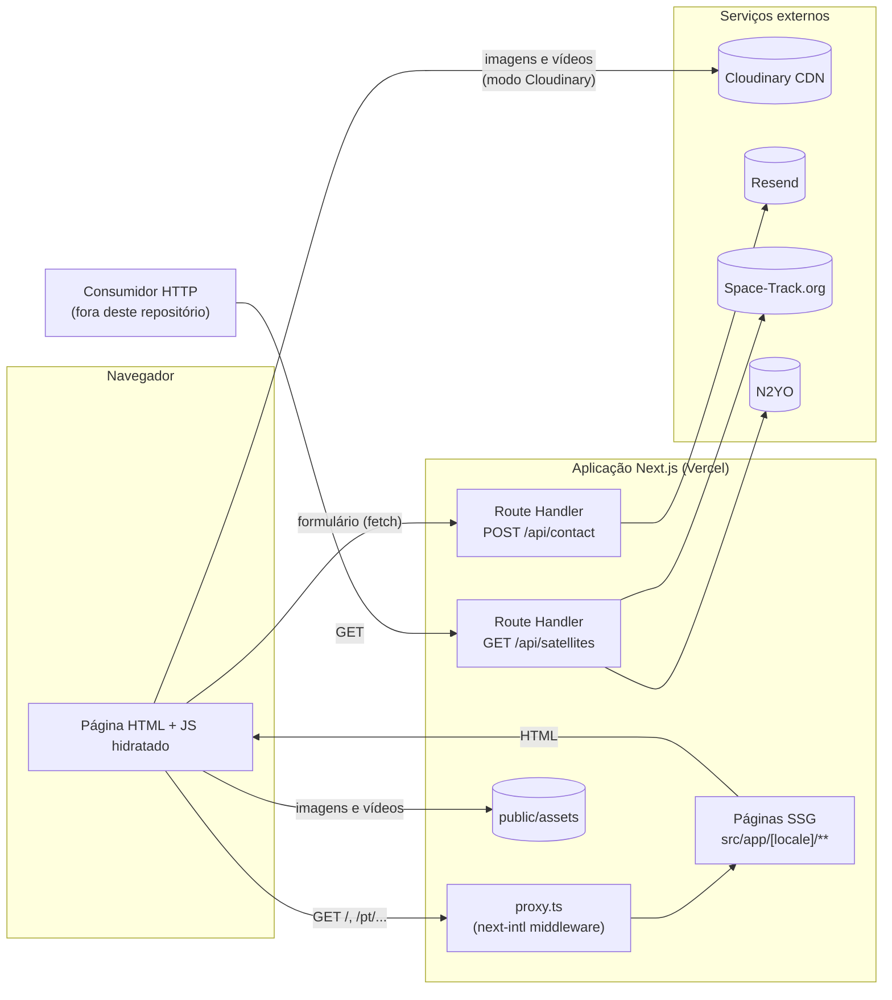
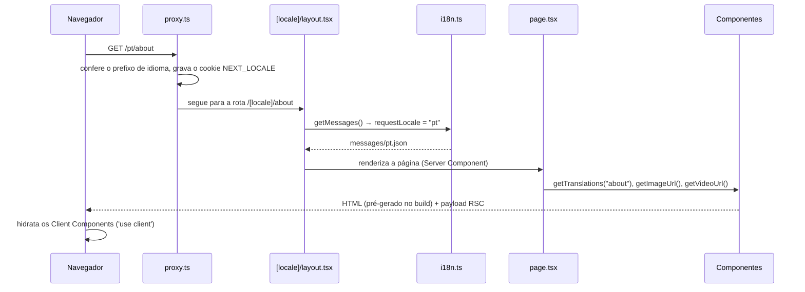
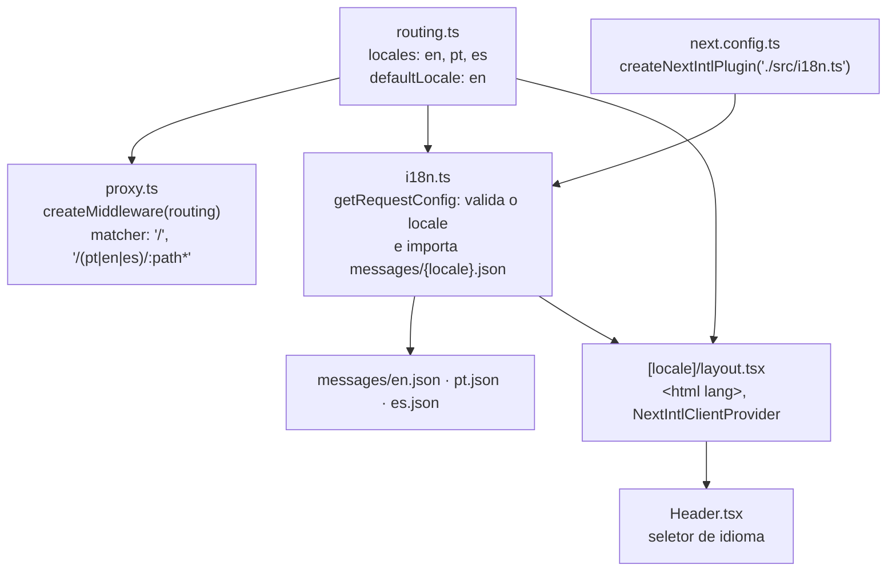
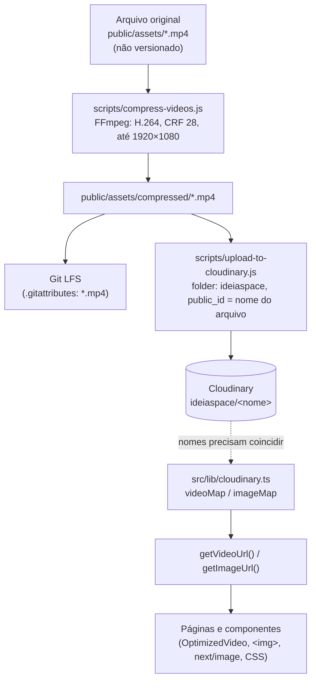
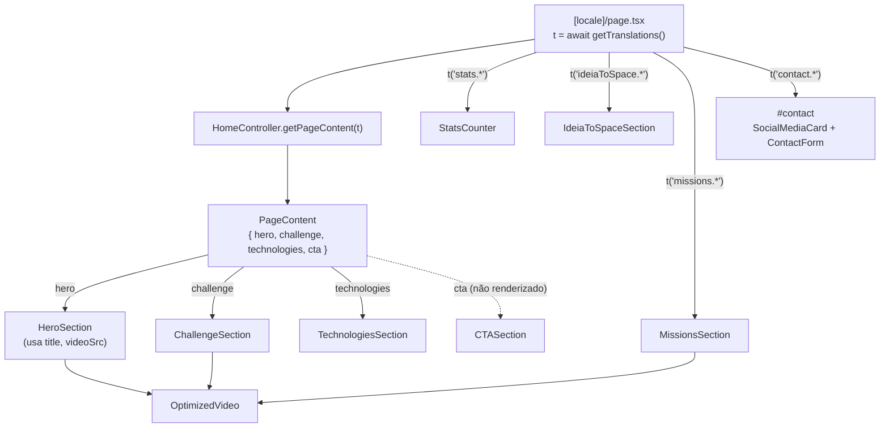
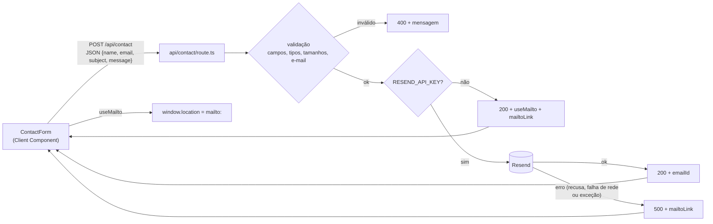
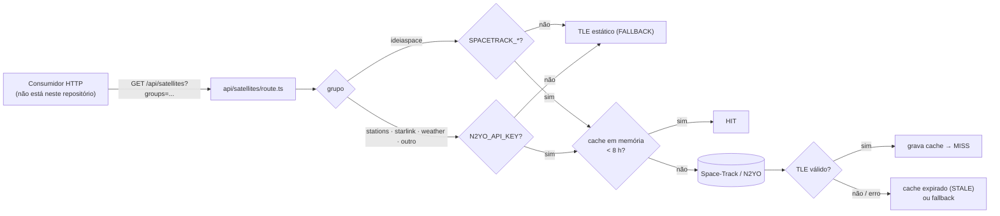

# Arquitetura

Este documento descreve como o site da IdeiaSpace está organizado e como uma requisição percorre a aplicação. Ele reflete o código atual. Pontos de comportamento que merecem atenção estão reunidos em [Limites e pontos conhecidos](#14-limites-e-pontos-conhecidos).

**Versões de referência** (`package-lock.json`): Next.js 16.0.8 · React 19.2 · next-intl 4.5.5 · Tailwind CSS 4.1 · TypeScript 5.9 · Node.js `>=20.9` (o `.nvmrc` fixa a versão 20).

## Sumário

1. [Visão geral](#1-visão-geral)
2. [Estrutura arquitetural](#2-estrutura-arquitetural)
3. [Ciclo de uma requisição](#3-ciclo-de-uma-requisição)
4. [Internacionalização](#4-internacionalização)
5. [Server Components × Client Components](#5-server-components--client-components)
6. [Build, SSG e execução dinâmica](#6-build-ssg-e-execução-dinâmica)
7. [Variáveis `NEXT_PUBLIC_*`](#7-variáveis-next_public_)
8. [Pipeline de mídia](#8-pipeline-de-mídia)
9. [Mapa de rotas](#9-mapa-de-rotas)
10. [Componentes e fluxo da Home](#10-componentes-e-fluxo-da-home)
11. [APIs](#11-apis)
12. [Serviços externos](#12-serviços-externos)
13. [Testes](#13-testes)
14. [Limites e pontos conhecidos](#14-limites-e-pontos-conhecidos)
15. [Referências](#15-referências)

---

## 1. Visão geral

### O que é a aplicação

É o site institucional da IdeiaSpace, uma empresa de educação espacial. Ele apresenta o programa **Desafio Espacial**, as missões (satélites PocketQube) desenvolvidas por estudantes, recursos educacionais, a equipe e um formulário de contato, em **inglês, português e espanhol**.

### Arquitetura geral

O projeto é **uma única aplicação Next.js** que usa o **App Router** (a pasta `src/app`). Não há backend separado nem banco de dados:

- **Páginas**: componentes React renderizados no servidor. No build, todas são geradas como HTML estático, uma vez para cada idioma.
- **Conteúdo**: todo o texto traduzível está em arquivos JSON (`messages/`). Parte do conteúdo (nomes, imagens, links, alguns números) está escrita diretamente nos componentes.
- **Route Handlers** (`src/app/api/*/route.ts`): duas funções server-side que conversam com serviços externos. Elas mantêm as credenciais no servidor e sempre têm um caminho de *fallback* quando as credenciais não existem.
- **Proxy** (`src/proxy.ts`): o middleware do Next.js (no Next 16 o arquivo de middleware se chama `proxy`). Ele cuida do prefixo de idioma das URLs.
- **Mídia**: imagens e vídeos vêm da pasta `public/` ou do Cloudinary (CDN), dependendo de uma variável de ambiente lida no build.

### Diagrama



---

## 2. Estrutura arquitetural

| Área | Responsabilidade |
|---|---|
| `src/app/` | **Roteamento e páginas** (App Router). `layout.tsx` raiz; `[locale]/` com o layout de idioma e as páginas; `api/` com os Route Handlers; `globals.css` com Tailwind e estilos globais; `icon.png` e `favicon.ico`. |
| `src/proxy.ts`, `src/routing.ts`, `src/i18n.ts` | **Internacionalização**: idiomas suportados, middleware de idioma e carregamento das traduções (ver a [seção 4](#4-internacionalização)). |
| `src/components/` | **Componentes de interface** reutilizáveis: cabeçalho, rodapé, formulário, vídeo com lazy-load, carrosséis e cards. Cada componente pode ter um `.css` ou `.module.css` ao lado. |
| `src/views/sections/` | **Seções da Home**: blocos de tela inteira (Hero, Desafio, Missões etc.) que compõem a página inicial. |
| `src/controllers/` | `home.controller.ts`: monta o objeto de conteúdo da Home a partir da função de tradução. |
| `src/models/` | `content.model.ts`: interfaces TypeScript do conteúdo da Home (`PageContent`, `HeroContent` etc.). Só tipos; não há lógica. |
| `src/lib/` | **Utilitários**. `cloudinary.ts` é o ponto central da mídia: decide se uma URL aponta para `public/` ou para o Cloudinary. `assets.ts` e `wordpress.ts` existem mas não são importados por nenhuma página. |
| `messages/` | **Conteúdo traduzido**: `en.json`, `pt.json`, `es.json`, com as mesmas chaves organizadas por *namespaces* (`nav`, `hero`, `about`, `services`, `contact`…). |
| `public/` | **Arquivos estáticos** servidos na raiz do site: imagens em `public/assets/` e vídeos comprimidos em `public/assets/compressed/` (versionados com Git LFS). |
| `scripts/` | **Scripts Node de manutenção de mídia**, executados manualmente: compressão de vídeo (FFmpeg), upload para o Cloudinary e geração de favicon. Não fazem parte do build. |

### Sobre controller/model/view

As pastas `controllers/`, `models/` e `views/` são usadas **apenas pela página inicial**. A Home chama `HomeController.getPageContent()`, que devolve um `PageContent` (definido em `models/`), e repassa partes desse objeto para as seções em `views/sections/`.

As outras páginas (`about`, `missions`, `services`, `technologies`, `teacher-resources`) não usam esse padrão: elas buscam as traduções e montam os componentes diretamente. Portanto, o projeto **não segue uma arquitetura MVC completa**. A organização geral é baseada em componentes, e o controller da Home é um caso isolado.

---

## 3. Ciclo de uma requisição



Na prática, para as páginas, os passos de layout e página **já foram executados no build** (ver a [seção 6](#6-build-ssg-e-execução-dinâmica)). Em produção, o servidor devolve o HTML pronto, e o ciclo acima descreve como esse HTML foi produzido.

### `/` (raiz)

1. Não existe `src/app/page.tsx`. A raiz é tratada **somente** pelo `proxy.ts`, cujo `matcher` inclui `'/'`.
2. O middleware do next-intl escolhe o idioma, nesta ordem: o cookie `NEXT_LOCALE`, depois o cabeçalho `Accept-Language` do navegador e, por último, o idioma padrão `en`.
3. Responde `307` redirecionando para `/en`, `/pt` ou `/es`.

### `/{locale}` (ex.: `/pt`)

1. O `proxy.ts` aceita o caminho (o `matcher` inclui `/(pt|en|es)/:path*`), grava o cookie `NEXT_LOCALE` com o idioma da URL e adiciona um cabeçalho `Link` com as versões alternativas (`hreflang`).
2. `src/app/layout.tsx` (raiz) só devolve `children`.
3. `src/app/[locale]/layout.tsx`:
   - chama `setRequestLocale(locale)`, necessário para a geração estática com next-intl;
   - chama `getMessages()`, que aciona `src/i18n.ts` e carrega `messages/pt.json`;
   - renderiza `<html lang="pt">`, a fonte Roboto Condensed, o `NextIntlClientProvider` (com todas as mensagens do idioma), o `Header`, o `<main>` com a página e o `ConditionalFooter`;
   - exporta `metadata` (título, descrição, ícones, OpenGraph) e `viewport`.
4. `src/app/[locale]/page.tsx` monta a Home (ver a [seção 10](#10-componentes-e-fluxo-da-home)).

### Páginas internas (ex.: `/pt/services`)

O fluxo é o mesmo de `/{locale}`, porque todas as páginas estão dentro do segmento `[locale]` e herdam o mesmo layout. A rota `missions` tem um `layout.tsx` próprio, que apenas repassa `children`. Cada página:

- chama `setRequestLocale(locale)`;
- busca seu *namespace* de traduções com `getTranslations('services')`, `getTranslations('about')` etc.;
- resolve URLs de mídia com `getImageUrl()`/`getVideoUrl()`;
- monta os componentes.

O rodapé não aparece em `/{locale}/missions`: o `ConditionalFooter` verifica se o caminho contém `/missions`.

### `/api/*`

As rotas de API **não passam pelo `proxy.ts`** (o `matcher` não as inclui) e não têm prefixo de idioma. Cada requisição executa diretamente a função exportada em `route.ts` (`POST` em `/api/contact`, `GET` em `/api/satellites`). Ver a [seção 11](#11-apis).

---

## 4. Internacionalização

A internacionalização usa a biblioteca **next-intl** e é distribuída entre cinco arquivos:



| Arquivo | Papel |
|---|---|
| `src/routing.ts` | Define `locales: ['en', 'pt', 'es']` e `defaultLocale: 'en'`. Também exporta `Link`, `redirect`, `usePathname` e `useRouter` do next-intl, que hoje não são usados pelos componentes. |
| `src/proxy.ts` | Cria o middleware com `createMiddleware(routing)`. O `matcher` lista os idiomas **escritos à mão** (`pt\|en\|es`). |
| `src/i18n.ts` | Configuração por requisição: lê o locale do segmento da URL; se não for um dos `routing.locales`, usa `defaultLocale`; carrega o JSON correspondente. Registrado no `next.config.ts` pelo plugin do next-intl. |
| `messages/*.json` | Os três arquivos têm o mesmo conjunto de chaves (204 cada), o que é garantido pelo teste `src/__tests__/messages-parity.test.ts`. Algumas mensagens contêm HTML (ex.: `<br/>`), renderizado com `dangerouslySetInnerHTML`. |
| `src/app/[locale]/layout.tsx` | Gera os parâmetros estáticos (`en`, `pt`, `es`), define `<html lang={locale}>` e entrega **todas** as mensagens do idioma ao `NextIntlClientProvider`, para que Client Components possam usar `useTranslations`. |
| `src/components/Header.tsx` | Mostra o seletor de idioma e faz a troca. |

### Idiomas e idioma padrão

- Suportados: **`en`** (inglês), **`pt`** (português), **`es`** (espanhol).
- Padrão: **`en`**.
- Todas as URLs de página têm prefixo de idioma (`/en/...`, `/pt/...`, `/es/...`).

### Detecção inicial

Ao acessar `/`, o middleware redireciona conforme o cookie `NEXT_LOCALE` ou, na falta dele, o `Accept-Language` do navegador. Um idioma não suportado no navegador (ex.: francês) resulta em `/en`. Toda página com prefixo válido atualiza o cookie `NEXT_LOCALE` com o idioma da URL.

### Troca de idioma

O `Header` (Client Component) faz:

```ts
const path = pathname.replace(`/${locale}`, `/${newLocale}`);
router.push(path);
```

usando `usePathname`/`useRouter` de `next/navigation`. Assim, `/pt/about` vira `/es/about` e a navegação acontece no cliente. O novo idioma passa pelo proxy normalmente, que atualiza o cookie.

### Carregamento das traduções

- **Server Components** (páginas): `await getTranslations('namespace')` ou `getTranslations()` para o objeto completo (usado pela Home).
- **Client Components**: `useTranslations('namespace')`, lendo as mensagens entregues pelo `NextIntlClientProvider`.

| Namespace | Usado por |
|---|---|
| `nav` | `Header` |
| `footer` | `Footer` |
| `common` | `ScrollIndicator` |
| `hero`, `stats`, `ideiaToSpace`, `challenge`, `missions`, `technologies`, `cta`, `contact` | Home (`page.tsx`, `HomeController`, `IdeiaToSpaceSection`) |
| `contact.form` | `ContactForm` |
| `about`, `leadership` | página `about` |
| `missions` | página `missions` |
| `services` (+ `services.stats`, `services.methodology.steps`) | página `services`, `StatsCarousel`, `MethodologyCarousel` |
| `technologies` | página `technologies` |

### O locale é tratado em mais de um ponto

O idioma é resolvido em três lugares, cada um com uma regra própria:

| Ponto | Regra |
|---|---|
| `proxy.ts` | Só intercepta `/` e caminhos que começam com `/pt`, `/en` ou `/es`. |
| `i18n.ts` | Se o locale da URL não for suportado, carrega as mensagens de `en`. |
| `[locale]/layout.tsx` | Usa o valor do segmento da URL **sem validá-lo** no atributo `lang`. Não chama `notFound()`. |

Como consequência, uma URL cujo primeiro segmento não é um idioma suportado (ex.: `/fr`, `/de`, `/about` sem prefixo) **não passa pelo proxy** e é atendida pela rota `[locale]`:

- a resposta é `200`;
- o conteúdo é a página correspondente **em inglês**;
- o HTML sai com `<html lang="fr">` (ou `lang="about"` etc.);
- os links internos apontam para `/en/...`;
- em produção a página é gerada sob demanda e guardada em cache.

Caminhos inexistentes **dentro** de um idioma válido (ex.: `/pt/naoexiste`) respondem `404` normalmente.

---

## 5. Server Components × Client Components

No App Router, todo componente é **Server Component por padrão**: ele roda no servidor (ou no build), produz HTML e não envia seu código JavaScript para o navegador. Um arquivo que começa com `'use client'` vira uma **fronteira de cliente**: ele e tudo o que ele importa passam a fazer parte do JavaScript enviado ao navegador, e são **hidratados** lá.

### Como a hidratação acontece

1. O HTML já chega pronto, inclusive com o conteúdo dos Client Components, que também são renderizados no servidor na primeira vez.
2. O navegador baixa o JavaScript dos Client Components e o payload RSC (a descrição serializada da árvore de Server Components e das props).
3. O React "hidrata" esses componentes: conecta eventos (`onClick`, `onSubmit`), inicia `useEffect`, `setInterval`, `IntersectionObserver` etc.
4. Server Components não são hidratados. Eles permanecem como HTML.

As props passadas de um Server Component para um Client Component precisam ser serializáveis (textos, números, objetos simples). É o caso, por exemplo, das listas de depoimentos e fases montadas em `services/page.tsx` e entregues aos carrosséis.

### Distribuição atual

| Server Components | Client Components (`'use client'`) |
|---|---|
| `app/layout.tsx`, `app/[locale]/layout.tsx`, `missions/layout.tsx` | `Header`, `ConditionalFooter` (e `Footer`, importado por ele) |
| Todas as páginas em `app/[locale]/**/page.tsx` | `ContactForm`, `OptimizedVideo`, `StatsCounter`, `ScrollIndicator` |
| `HeroSection`, `ChallengeSection`, `MissionsSection` (e `CTASection`, não usada) | `IdeiaToSpaceSection`, `TechnologiesSection` |
| — | Carrosséis e cards: `TestimonialsCarousel`, `TestimonialCard`, `PhasesCarousel`, `StatsCarousel`, `MethodologyCarousel`, `MissionBadges`, `ResourceCard`, `LeadershipCard`, `SocialMediaCard`, `BenefitsCarousel`, `HistoryCarousel`, `MVVCarousel`, `PartnersCarousel` |

`Footer.tsx` não declara `'use client'`, mas é importado por `ConditionalFooter` (que declara). Por isso ele roda como Client Component.

### Por que esses componentes precisam do cliente

| Componente | Recurso de navegador que exige o cliente |
|---|---|
| `Header` | Estado do menu mobile e do seletor de idioma (`useState`), `usePathname`/`useRouter` para trocar de idioma |
| `ConditionalFooter` | `usePathname` para esconder o rodapé em `/missions` |
| `ContactForm` | Estado dos campos, envio com `fetch`, mensagens de status, redirecionamento para `mailto:` |
| `StatsCounter` | `IntersectionObserver` para iniciar a animação ao aparecer na tela; `setInterval` para contar |
| `OptimizedVideo` | `IntersectionObserver` para só inserir a fonte do vídeo quando ele se aproxima da tela (lazy-load) |
| `TestimonialsCarousel`, `StatsCarousel` | Estado do slide atual e avanço automático com `setInterval`; pausa no hover (`TestimonialsCarousel`) |
| `PhasesCarousel`, `MissionBadges` | Estado do item selecionado e cliques |
| `ResourceCard` | Clique que navega com `useRouter` |
| `IdeiaToSpaceSection` | Mede a largura do título e escuta `resize` |
| `TechnologiesSection` | Lê o idioma com `useParams` |

Alguns componentes marcados com `'use client'` não usam nenhum recurso exclusivo do navegador: `BenefitsCarousel`, `HistoryCarousel`, `MVVCarousel` (cartões com efeitos de CSS e vídeos `autoPlay`), `PartnersCarousel`, `SocialMediaCard`, `LeadershipCard`, `TestimonialCard` e `MethodologyCarousel` (este usa apenas `useTranslations`, que também funciona no servidor). Eles funcionam como Client Components porque assim estão declarados.

---

## 6. Build, SSG e execução dinâmica

O comando `npm run build` (`next build`, com o Turbopack) gera três tipos de saída:

| Tipo | O que é | Neste projeto |
|---|---|---|
| **SSG** (●) | HTML gerado **uma vez, no build**, usando `generateStaticParams` | 6 rotas de página × 3 idiomas = **18 páginas** |
| **Static** (○) | Arquivo estático sem parâmetros | `/_not-found`, `/icon.png` |
| **Dynamic** (ƒ) | Código executado **a cada requisição** | `/api/contact`, `/api/satellites` |
| **Proxy** | Middleware executado antes das rotas que casam com o `matcher` | `src/proxy.ts` |

### Por que as páginas são SSG

`src/app/[locale]/layout.tsx` exporta:

```ts
export function generateStaticParams() {
  return routing.locales.map((locale) => ({locale}));
}
```

Como o layout está acima de todas as páginas, esse parâmetro vale para todas elas. No build, o Next executa cada página para `en`, `pt` e `es`. As chamadas a `setRequestLocale(locale)` nas páginas e no layout permitem que o next-intl funcione sem ler cabeçalhos da requisição, condição para a geração estática.

Rotas geradas:

```
/en  /pt  /es
/{en,pt,es}/about
/{en,pt,es}/missions
/{en,pt,es}/services
/{en,pt,es}/technologies
/{en,pt,es}/teacher-resources
```

Em produção, essas páginas são servidas do cache (`x-nextjs-cache: HIT`, `Cache-Control: s-maxage=31536000`). Um valor de `[locale]` que não está na lista (ex.: `/fr`) é renderizado sob demanda na primeira requisição e depois também fica em cache. É o comportamento padrão do Next quando `dynamicParams` não é configurado, e o projeto não o configura.

### O que é dinâmico

- **Route Handlers**: as duas APIs executam a cada chamada. A de satélites mantém um cache em memória do processo (ver a [seção 11](#11-apis)).
- **Proxy**: roda a cada requisição de `/` e de caminhos com prefixo de idioma, antes de entregar a página estática.
- **Navegador**: carrosséis, contadores, lazy-load de vídeo e formulário rodam no cliente após a hidratação.

---

## 7. Variáveis `NEXT_PUBLIC_*`

O projeto lê duas variáveis públicas em `src/lib/cloudinary.ts`:

```ts
const CLOUDINARY_CLOUD_NAME = process.env.NEXT_PUBLIC_CLOUDINARY_CLOUD_NAME || 'dgyueliom';
const USE_CLOUDINARY = process.env.NEXT_PUBLIC_USE_CLOUDINARY === 'true';
```

| Variável | Efeito | Se ausente |
|---|---|---|
| `NEXT_PUBLIC_USE_CLOUDINARY` | Quando é exatamente a string `"true"`, `getVideoUrl()`/`getImageUrl()` devolvem URLs do Cloudinary para os arquivos mapeados | Qualquer outro valor (ou ausência) → URLs locais `/assets/...` |
| `NEXT_PUBLIC_CLOUDINARY_CLOUD_NAME` | Nome da conta Cloudinary usada nas URLs | Usa `dgyueliom`, definido no código |

O prefixo `NEXT_PUBLIC_` faz o Next **substituir o valor no código** durante o build, para que ele também exista no JavaScript enviado ao navegador. Por isso essas variáveis **nunca devem conter segredos**.

### São avaliadas durante o build

Como as páginas são SSG, `getVideoUrl()` e `getImageUrl()` **executam durante o `next build`**, e o resultado é gravado no HTML:

```text
next build
   ↓
[locale]/page.tsx → HomeController → getVideoUrl('ideiaforword.mp4')
   ↓
USE_CLOUDINARY === true ?
   ├─ sim → https://res.cloudinary.com/dgyueliom/video/upload/q_auto:eco,f_auto/ideiaspace/ideiaforword
   └─ não → /assets/ideiaforword.mp4
   ↓
URL escrita em .next/server/app/{en,pt,es}.html
   ↓
O servidor entrega esse HTML pronto a cada visita
```

Consequências:

- Para o site usar o Cloudinary, `NEXT_PUBLIC_USE_CLOUDINARY=true` precisa estar definida **no ambiente onde o build roda** (na Vercel, uma variável disponível na etapa de build).
- **Definir ou mudar a variável depois do build não altera o HTML já gerado.** É preciso refazer o build.
- Em `npm run dev`, as páginas são renderizadas a cada requisição, mas o valor é lido quando o servidor de desenvolvimento inicia. Mudar a variável exige reiniciar o `next dev`.
- O CI (`.github/workflows/ci.yml`) roda o build **sem** essa variável. O artefato de build do CI, portanto, usa sempre caminhos locais.

As variáveis de servidor (`RESEND_API_KEY`, `N2YO_API_KEY`, `SPACETRACK_USERNAME`, `SPACETRACK_PASSWORD`) não têm esse comportamento: são lidas pelos Route Handlers em tempo de execução, e não vão para o navegador.

---

## 8. Pipeline de mídia

### Fluxo completo



| Etapa | Arquivo | Detalhes |
|---|---|---|
| Compressão | `scripts/compress-videos.js` (`npm run compress:videos`) | Lê `public/assets/<nome>.mp4`, grava em `public/assets/compressed/<nome>.mp4`. Requer FFmpeg. Pula arquivos já comprimidos. |
| Versionamento | `.gitattributes` | `*.mp4` é armazenado no Git LFS. É preciso `git lfs pull` para ter os vídeos reais. |
| Upload | `scripts/upload-to-cloudinary.js` (`npm run upload:cloudinary`) | Lê credenciais de `.env.local` (`NEXT_PUBLIC_CLOUDINARY_CLOUD_NAME`, `CLOUDINARY_API_KEY`, `CLOUDINARY_API_SECRET`). Envia vídeos (preferindo a versão comprimida) e imagens com `folder: 'ideiaspace'`. O `public_id` final é `ideiaspace/<nome sem extensão>`. |
| Mapeamento | `src/lib/cloudinary.ts` | `videoMap` e `imageMap` relacionam o nome do arquivo usado no código (`'space.mp4'`) ao `public_id` (`'ideiaspace/space'`). |
| Resolução | `getVideoUrl(nome)`, `getImageUrl(nome)` | Decidem entre CDN e caminho local. |
| Consumo | páginas e componentes | Vídeos: `OptimizedVideo` (lazy-load) ou `<video>` direto nos carrosséis. Imagens: ``, `next/image` ou `background-image` via `style`. |

### Modo local (padrão)

```text
getVideoUrl('space.mp4')   →  /assets/space.mp4
getImageUrl('falcon9.jpg') →  /assets/falcon9.jpg
```

O caminho é sempre `/assets/<nome>`, servido a partir de `public/assets/`.

**Para vídeos, esse caminho não corresponde à localização real dos arquivos.** Os `.mp4` versionados estão em `public/assets/compressed/`, e não existe nenhum `.mp4` diretamente em `public/assets/`. No modo local, as URLs de vídeo geradas (`/assets/space.mp4`, `/assets/emblema.mp4` etc.) respondem `404`, e os vídeos não são exibidos. As imagens não têm esse problema: elas estão em `public/assets/`.

### Modo Cloudinary (`NEXT_PUBLIC_USE_CLOUDINARY=true`)

```text
getVideoUrl('space.mp4')
  → https://res.cloudinary.com/<cloud>/video/upload/q_auto:eco,f_auto/ideiaspace/space

getImageUrl('falcon9.jpg')
  → https://res.cloudinary.com/<cloud>/image/upload/q_80,f_auto/ideiaspace/falcon9
```

- Vídeos: qualidade `auto:eco` e formato `auto`.
- Imagens: qualidade `80` e formato `auto` (WebP/AVIF quando o navegador suporta).
- Só os nomes presentes em `videoMap`/`imageMap` vão para o CDN. Qualquer outro nome cai no caminho local mesmo com o modo ligado.
- `vetorizada.png` (o logo) **sempre** vem do local.

### Imagens fora do mapeamento

Várias imagens são referenciadas diretamente como `/assets/...` e **sempre** vêm de `public/assets/`, independentemente do modo. Por exemplo: `MethodologyCarousel` (`card1.png`…`card5.jpg`), `ResourceCard` em `technologies` (`sat.png`, `kiteducational.png`…), `partner9.png`, `student4.png`, `contador.jpg` e `missionbagde*.png` (estas passam por `getImageUrl`, mas não estão no `imageMap`).

### Outros arquivos de mídia

- `src/lib/assets.ts` define outro esquema de `public_id` (`ideiaspace/videos/...`, `ideiaspace/images/...`), que não corresponde aos arquivos publicados no Cloudinary. O módulo não é importado pela aplicação.
- O domínio `res.cloudinary.com` está liberado em `images.remotePatterns` no `next.config.ts`, o que permite usar URLs do Cloudinary com `next/image`.

---

## 9. Mapa de rotas

### Páginas

| Rota | Função | Idiomas | Acesso |
|---|---|---|---|
| `/` | Redireciona para o idioma detectado (`307`) | — | Entrada do site |
| `/{locale}` | Home: vídeo de abertura, estatísticas, programa, Desafio, Missões, Recursos, contato | en, pt, es | Logo e item "Início" do menu |
| `/{locale}/about` | Sobre: proposta de valor, história, missão/visão/valores, parceiros, liderança | en, pt, es | Menu "Sobre Nós", botão da Home, rodapé |
| `/{locale}/missions` | Missões: apresentação e emblemas das 5 missões de estudantes (sem rodapé) | en, pt, es | Menu "Missões", botão da Home |
| `/{locale}/services` | Desafio Espacial: programa, números, fases, metodologia (`#methodology`) e depoimentos | en, pt, es | Menu "Desafio", botão da Home, rodapé |
| `/{locale}/technologies` | Recursos educacionais: 9 cards (todos marcados como "Work in Progress") | en, pt, es | Menu "Recursos", botão da Home, rodapé |
| `/{locale}/teacher-resources` | Página provisória "Recursos para Professores — em breve" (texto fixo em português) | en, pt, es | **Nenhum link aponta para ela** (página órfã) |
| `/{locale}#contact` | Âncora da seção de contato da Home | en, pt, es | Botão "Contato" do menu, rodapé, cards de `technologies` |

### Rotas de API

| Rota | Método | Detalhes |
|---|---|---|
| `/api/contact` | `POST` | [seção 11](#11-apis) e [`API_DOCUMENTATION.md`](../API_DOCUMENTATION.md) |
| `/api/satellites` | `GET` | [seção 11](#11-apis) e [`API_DOCUMENTATION.md`](../API_DOCUMENTATION.md) |

### Links externos do menu

| Rótulo | Destino |
|---|---|
| Programação | `https://ideia-spacetoweb.vercel.app/` |
| Nossos Satélites | `https://tleideiaspaceview.vercel.app` |

### Nome da rota × nome no menu

Os nomes das pastas de rota não coincidem com os rótulos exibidos:

| Rota | Chave no menu | en | pt | es |
|---|---|---|---|---|
| `/services` | `nav.spaceChallenge` | Challenge | Desafio | Desafío |
| `/technologies` | `nav.teacherResources` | Resources | Recursos | Recursos |
| `/teacher-resources` | — | — | — | — (não aparece no menu) |

Ou seja: `/services` é a página do **Desafio**, `/technologies` é a página de **Recursos** e `/teacher-resources` existe, mas não é acessível pela navegação.

### Links para rotas inexistentes

| Origem | Destino | Resultado |
|---|---|---|
| Rodapé | `/{locale}/terms`, `/{locale}/privacy` | `404` |
| Rodapé (LinkedIn, Facebook) e cards de liderança (LinkedIn) | `#` | Sem destino |
| Props `link` dos cards em `technologies` (`/edusat`, `/orbital`, `/methodology`, `/training`, `/constellation`) | — | Não são usadas: todos os cards estão como "Work in Progress" e o clique leva a `/{locale}#contact` |

URLs com primeiro segmento que não é um idioma válido (`/fr`, `/about` etc.) seguem o comportamento descrito na [seção 4](#o-locale-é-tratado-em-mais-de-um-ponto).

---

## 10. Componentes e fluxo da Home



A Home é um contêiner com altura de tela e rolagem com *scroll-snap* (`h-screen overflow-y-scroll snap-y snap-mandatory`). As seções aparecem nesta ordem:

| # | Seção | Dados de tradução | Definido no código |
|---|---|---|---|
| 1 | `HeroSection` | `hero.title` (via controller) | Vídeo `ideiaforword.mp4` (controller) |
| 2 | `StatsCounter` | `stats.title`, `stats.subtitle`, os 3 números e rótulos | Tamanhos dos números, imagem `contador.jpg`, órbitas em SVG |
| 3 | `IdeiaToSpaceSection` | `ideiaToSpace.title`, `ideiaToSpace.description` (HTML), `hero.aboutButton` | Imagem `falcon9.jpg`, link para `/about` |
| 4 | `ChallengeSection` | `challenge.title`, `challenge.description` (HTML), `challenge.button` (via controller) | Vídeo `desafioespacial.mp4`, link para `/services` (controller) |
| 5 | `MissionsSection` | `missions.title`, `missions.description`, `missions.button` | Vídeo `emblema.mp4`, link para `/missions` |
| 6 | `TechnologiesSection` | `technologies.title`, `technologies.description` (HTML), `technologies.button` (via controller) | Imagem `Recursos.png`, link para `/technologies` |
| 7 | Contato (`#contact`) | `contact.title`, `contact.description`, `contact.form.*` | Links de `SocialMediaCard`; mensagens de retorno da API |

### O papel do controller

`HomeController.getPageContent(t)` recebe a função de tradução e devolve um `PageContent` com quatro blocos: `hero`, `challenge`, `technologies` e `cta`. Ele concentra textos, URLs de vídeo e links de destino dessas seções. Parte desse objeto não é exibida:

- `HeroSection` usa apenas `title` e `videoSrc`; `subtitle`, `buttonText`, `buttonLink` e `aboutButton` não são renderizados;
- o bloco `cta` é montado, mas `CTASection` não é usado na página.

As seções 2, 3, 5 e 7 não passam pelo controller: recebem os textos diretamente de `page.tsx` ou buscam traduções por conta própria.

### Conteúdo definido diretamente nos componentes (todo o site)

Além das traduções, parte do conteúdo está escrita no código:

| Conteúdo | Onde |
|---|---|
| Nomes, cargos (via tradução), fotos e Instagram dos líderes | `about/page.tsx` (lista duplicada para mobile e desktop) |
| Logos e nomes dos parceiros | `PartnersCarousel.tsx` |
| Fotos e notas dos depoimentos (nomes e textos vêm das traduções) | `services/page.tsx` |
| Números "500" e "30" do carrossel de estatísticas | `StatsCarousel.tsx` |
| Imagens e cores das etapas da metodologia | `MethodologyCarousel.tsx` |
| Imagens dos emblemas das missões | `missions/page.tsx` |
| Imagens, links e estado "Work in Progress" dos recursos | `technologies/page.tsx` |
| Redes sociais e número de WhatsApp | `SocialMediaCard.tsx`, `Footer.tsx` |
| Links externos do menu | `Header.tsx` |
| Destinatário e remetente do e-mail de contato | `api/contact/route.ts` |
| Razão social e CNPJ | `Footer.tsx` |
| Título, descrição e OpenGraph do site (em inglês, iguais nos 3 idiomas) | `[locale]/layout.tsx` (`metadata`) |

---

## 11. APIs

Os contratos completos (parâmetros, respostas, cabeçalhos, variáveis, troubleshooting) estão em [`API_DOCUMENTATION.md`](../API_DOCUMENTATION.md). Esta seção mostra como as APIs se encaixam na arquitetura.

### Contato



- O componente envia os dados e exibe o campo `message` (sucesso) ou `error` (falha) da resposta. Se a resposta trouxer `useMailto`, abre o cliente de e-mail do visitante.
- A rota escapa os campos antes de inseri-los no HTML do e-mail.
- O cliente Resend só é criado quando há chave, o que permite o `next build` sem segredos.
- O SDK do Resend não lança exceção quando o envio é recusado ou o serviço está inacessível: devolve `{ data: null, error }`. A rota trata esse `error` como falha e responde `500` com o `mailtoLink`, como faz quando a chamada lança uma exceção.
- As mensagens de retorno são definidas na rota, em português, e não passam pelo i18n.

### Satélites



- A rota funciona como um **proxy server-side** para dados orbitais no formato TLE (`text/plain`): guarda as credenciais no servidor, aplica cache em memória de 8 horas e nunca responde com erro. Sem credenciais ou em caso de falha, devolve dados de exemplo.
- Os cabeçalhos `X-Cache-Status` (`HIT`, `MISS`, `STALE`, `FALLBACK`) e `X-Data-Source` informam a origem da resposta.
- O cache é uma variável do módulo e só existe enquanto o processo do servidor estiver vivo.

**Por que a rota existe sem ser consumida aqui:** nenhuma página ou componente deste repositório chama `/api/satellites`. A rota é parte da aplicação (está no build, tem testes e documentação própria) e foi feita para ser chamada por HTTP: o grupo `ideiaspace` contém os satélites da empresa (SARI-1, SARI-2, ANISC) e o formato de saída é o esperado por bibliotecas de propagação orbital. As dependências `satellite.js`, `react-globe.gl` e `three` estão declaradas no `package.json`, mas não são importadas pelo código atual. O consumidor da rota não está registrado no repositório. O item "Nossos Satélites" do menu leva a uma aplicação externa (`tleideiaspaceview.vercel.app`).

---

## 12. Serviços externos

| Serviço | Posição na arquitetura | Onde aparece | Sem configuração |
|---|---|---|---|
| **Cloudinary** | CDN de imagens e vídeos. O navegador baixa a mídia diretamente da CDN; a aplicação só monta as URLs. Os uploads são feitos manualmente por script. | `src/lib/cloudinary.ts`, `scripts/upload-to-cloudinary.js`, `next.config.ts` (`remotePatterns`) | Mídia servida de `public/` (com o problema dos vídeos descrito na [seção 8](#modo-local-padrão)) |
| **Resend** | Envio do e-mail do formulário, chamado pelo Route Handler de contato. | `src/app/api/contact/route.ts` | Resposta com link `mailto:` |
| **Space-Track.org** | Fonte dos TLEs do grupo `ideiaspace`. Login por formulário e consulta com cookie a cada busca não-cacheada. | `src/app/api/satellites/route.ts` | TLE estático |
| **N2YO** | Fonte dos TLEs dos demais grupos. Uma requisição por satélite, com intervalo de 100 ms e limite de 20 s. | `src/app/api/satellites/route.ts` | TLE estático |
| **Vercel** | Hospedagem e execução (páginas estáticas, Route Handlers como funções, proxy). Região `gru1`; deploy de `main`. | `vercel.json` | — |
| **GitHub Actions** | Lint, typecheck, testes, build, fuzz, CodeQL, segurança e deploy. Ver [`docs/CI-CD.md`](CI-CD.md). | `.github/workflows/` | — |
| **Git LFS** | Armazena os `.mp4` fora do histórico Git comum. A Vercel está configurada com `lfs: true`. | `.gitattributes`, `vercel.json` | Clonar sem LFS traz apenas ponteiros no lugar dos vídeos |
| **Google Fonts** | Fonte Roboto Condensed, baixada no build pelo `next/font`. | `src/app/[locale]/layout.tsx` | — |

---

## 13. Testes

Os testes usam **Vitest** com ambiente **jsdom**, **Testing Library** e **fast-check**. Configuração em `vitest.config.ts` e `vitest.setup.ts`. Ficam em pastas `__tests__/` ao lado do código testado:

| Arquivo | Cobre |
|---|---|
| `src/app/api/__tests__/contact.test.ts` | Validação, fallback `mailto`, envio com Resend simulado, escape de HTML, `error` devolvido pelo SDK e exceção no envio |
| `src/app/api/__tests__/contact.resend-sdk.test.ts` | Contrato real do SDK do Resend, com só o `fetch` simulado: aceite → `200`; recusa `403` e falha de rede → `500` |
| `src/app/api/__tests__/contact.fuzz.test.ts` | Corpos arbitrários nunca geram exceção nem 5xx |
| `src/app/api/__tests__/satellites.test.ts` | Fallbacks sem credenciais, montagem do TLE a partir da N2YO, TLE inválido, falha de rede, cache HIT |
| `src/lib/__tests__/cloudinary.test.ts` | Montagem das URLs e alternância local/Cloudinary |
| `src/lib/__tests__/cloudinary.fuzz.test.ts` | As funções de URL nunca lançam exceção |
| `src/controllers/__tests__/home.controller.test.ts` | Formato do `PageContent` e uso da função de tradução |
| `src/__tests__/messages-parity.test.ts` | `en`, `pt` e `es` com o mesmo conjunto de chaves |

São 8 arquivos e 35 testes. A cobertura é medida apenas em `src/lib`, `src/controllers`, `src/models` e `src/app/api`, com limites mínimos definidos no `vitest.config.ts`.

**Escopo:** os testes cobrem a **lógica** (helpers de mídia, controller, paridade das traduções) e as **APIs**, com serviços externos simulados. **Não há testes de componentes, de páginas nem testes end-to-end** em navegador. Comportamentos de interface (navegação, troca de idioma, carregamento real de vídeos e imagens, formulário no navegador) não têm cobertura automatizada.

Comandos e execução no CI: [`CONTRIBUTING.md`](../CONTRIBUTING.md) e [`docs/CI-CD.md`](CI-CD.md).

---

## 14. Limites e pontos conhecidos

Comportamentos atuais que um desenvolvedor precisa conhecer antes de trabalhar no projeto.

- **Vídeos no modo local.** Sem `NEXT_PUBLIC_USE_CLOUDINARY=true`, as URLs de vídeo apontam para `/assets/<nome>.mp4`, mas os arquivos estão em `/assets/compressed/`. Os vídeos não carregam em desenvolvimento local nem em builds sem a variável.
- **`NEXT_PUBLIC_*` depende do build.** O valor fica gravado no HTML gerado. Alterá-lo exige um novo build (ou reiniciar o `next dev`).
- **Locales inválidos.** Qualquer primeiro segmento de URL que não seja `en`, `pt` ou `es` (incluindo `/about` sem prefixo) gera uma página `200` em inglês com `lang` inválido, que fica em cache em produção.
- **Locales escritos em dois lugares.** Os idiomas estão em `routing.ts` e também, à mão, no `matcher` de `proxy.ts`.
- **Conteúdo parcialmente fixo no código.** Equipe, parceiros, alguns números, imagens e links estão nos componentes, não em `messages/` (ver a [seção 10](#conteúdo-definido-diretamente-nos-componentes-todo-o-site)).
- **Textos fora do i18n.** Respostas da API de contato, "Saiba Mais" e "Work in Progress" nos cards, a página `teacher-resources`, o rótulo "Idioma / Language" do menu mobile, vários `alt`/`aria-label` e os metadados do site não variam com o idioma.
- **HTML nas traduções.** Algumas mensagens contêm marcação e são renderizadas com `dangerouslySetInnerHTML`. Editar essas chaves é editar HTML.
- **Todas as traduções vão para o navegador.** O `NextIntlClientProvider` recebe o JSON completo do idioma em todas as páginas.
- **Rotas e menu com nomes diferentes**, uma página órfã (`teacher-resources`) e links para páginas inexistentes (`/terms`, `/privacy`).
- **Código não utilizado.** Não são importados pela aplicação: `AnimatedPattern`, `CloudinaryVideo`, `EcosystemCard`, `ImpactCards`, `ImpactCarousel`, `InfoCard`, `JourneyCard`, `SlowVideo`, `TechnologyCard`, `WhatsAppButton`, `CTASection`, `lib/assets.ts`, `lib/wordpress.ts`. `AboutCarousel` é importado em `about/page.tsx`, mas não é renderizado. As dependências `three`, `react-globe.gl`, `satellite.js` e `next-cloudinary` não são importadas.
- **Cache da API de satélites em memória.** Ele só dura enquanto o processo do servidor estiver ativo.

---

## 15. Referências

| Documento | Conteúdo |
|---|---|
| [`API_DOCUMENTATION.md`](../API_DOCUMENTATION.md) | Contrato detalhado de `/api/contact` e `/api/satellites` |
| [`docs/CI-CD.md`](CI-CD.md) | Workflows do GitHub Actions, secrets e fluxo de deploy |
| [`CONTRIBUTING.md`](../CONTRIBUTING.md) | Setup, variáveis de ambiente, fluxo de branches e comandos de teste |
| [`SECURITY.md`](../SECURITY.md) | Superfície de ataque e como reportar vulnerabilidades |
